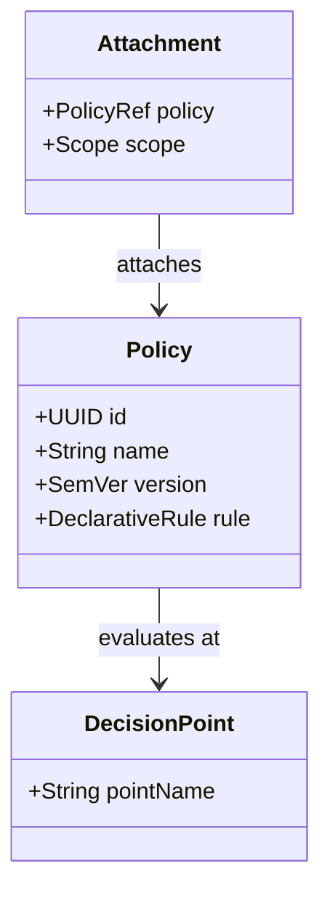
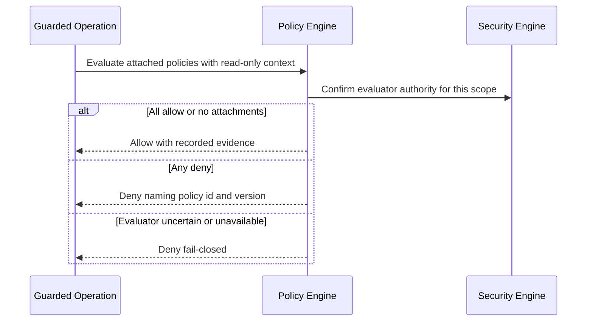

# 063 – Policy Engine

**Document ID:** DEVOS-SPEC-063

**Version:** 0.1

**Status:** Draft

**Category:** Enterprise

**Depends On:**

- DEVOS-SPEC-006 – Terminology
- DEVOS-SPEC-011 – Domain Model
- DEVOS-SPEC-013 – Object Lifecycle
- DEVOS-SPEC-020 – Workspace Specification
- DEVOS-SPEC-027 – Template Specification
- DEVOS-SPEC-030 – System Architecture
- DEVOS-SPEC-031 – Workspace Engine
- DEVOS-SPEC-035 – Template Engine
- DEVOS-SPEC-036 – Security Engine
- DEVOS-SPEC-056 – Hooks API
- DEVOS-SPEC-060 – Organizations

**Referenced By:**

- DEVOS-SPEC-036 – Security Engine
- DEVOS-SPEC-044 – Workspace Lifecycle
- DEVOS-SPEC-053 – Template SDK
- DEVOS-SPEC-054 – Workspace SDK
- DEVOS-SPEC-056 – Hooks API

---

# Abstract

This document defines the Policy Engine, the forward-looking Enterprise service that evaluates declarative policies at defined decision points across the platform.

It defines the policy model, attachment scopes inherited from organizational structure, decision-point integration through existing extension surfaces, and fail-closed evaluation semantics.

This specification is forward-looking: it activates only through an approved RFC and ADR and imposes no obligations on Version 0.1 implementations.

---

# Purpose

This specification answers the following question:

> **How can organizations express rules once and have every relevant operation honor them automatically?**

Policies are data.

Decision points are declared surfaces that already exist, chiefly hooks and guards.

The engine evaluates policies against live context and returns allow, deny, or obligation outcomes.

Uncertainty denies, exactly like every other authorization path.

---

# Goals

This specification aims to:

- Define policies as versioned declarative artifacts.
- Define policy attachments over organization, team, and workspace scopes.
- Define integration with hook points per DEVOS-SPEC-056.
- Define guard extension for lifecycle operations per DEVOS-SPEC-031.
- Define template eligibility policies per DEVOS-SPEC-035.
- Preserve determinism and offline operation where decisions are local.

---

# Non Goals

This specification does not define:

- Role bundling mechanics, owned by DEVOS-SPEC-062
- A policy language grammar in Version 0.1 of this extension; language design arrives with its activation RFC
- Secret custody or redaction, owned by DEVOS-SPEC-036
- Audit storage, owned by DEVOS-SPEC-065
- Real-time external decision services requiring network round trips on hot paths

---

# Model

A policy states conditions over context attributes exposed by its decision point.

Contexts are read-only and secret-free, identical to hook context discipline per DEVOS-SPEC-056.

---

# Decision Points

Policies evaluate only where the platform declares decision points.

| Integrated Surface   | Point Source                              | Outcome Applied                                    |
| -------------------- | ------------------------------------------- | ---------------------------------------------------- |
| Hook points          | Catalog of DEVOS-SPEC-056.                  | Veto with policy reason code on deny.                 |
| Lifecycle guards     | Operation guards of DEVOS-SPEC-044.          | Additional named clauses attributed to failing policy.|
| Template eligibility | Select stage of DEVOS-SPEC-035.              | Template excluded from selectable pool.               |
| Provider selection   | Candidate filtering inside DEVOS-SPEC-039.   | Candidates removed before routing.                    |

Rules:

- The engine adds decision points only through governance per DEVOS-SPEC-000; it never invents interception implicitly.
- Outcomes carry stable reason codes identifying the deciding policy by identifier and version.
- Multiple matching policies compose conservatively: any deny denies; obligations accumulate.

---

# Evaluation Semantics

Evaluation is deterministic and fail-closed.

Rules:

- Decisions resolve against effective membership and bindings at decision time, consistent with DEVOS-SPEC-061 and DEVOS-SPEC-062.
- Policy versions pin behavior; updating a policy is a new version, never silent mutation.
- Denials are indistinguishable with respect to unrelated resource existence, mirroring DEVOS-SPEC-036 discipline.
- Every decision emits an auditable record per DEVOS-SPEC-065.

---

# Relationship to Version 0.1

Version 0.1 embeds all required gates directly in engine specifications: the activation gate, validation pipeline, permission evaluation, and hook vetoes.

This document generalizes gate expression into administrable data.

Activation requires an RFC including the concrete policy language, an approved ADR preserving aggregate invariants, and schema additions beside existing canonical schemas.

Until activated, implementations MUST NOT ship partial policy evaluation.

---

# Enterprise Extension Invariants

The following invariants MUST hold when activated.

- Policies are declarative data and never execute arbitrary code.
- Evaluation happens only at governed decision points.
- Any deny denies; uncertainty always denies.
- Decisions identify the exact policy and version responsible.
- Policy updates are versioned events, never in-place rewrites.
- Local decisions complete offline; remote evaluators degrade to fail-closed denial honestly.

These MUST NOT break the single Workspace aggregate model.

---

# Security Requirements

When activated, this extension enforces:

- Contexts passed to evaluation pass the Redaction Service of DEVOS-SPEC-036 wherever observable.
- Administration of policies requires explicit authority evaluated deny-by-default per DEVOS-SPEC-036.
- Full attribution of policy administration and decisions through audit events per DEVOS-SPEC-065.
- No policy may grant capabilities; policies restrict or obligate, never widen, preserving least privilege per Rule 8 of SPECIFICATION_RULES.md.

---

# Future Extensions

Future specifications may add support for:

- The concrete declarative policy language with schema-backed validation
- Simulation and dry-run evaluation of policies against historical records
- Organization-wide inheritance with local override semantics
- Signed policy distributions for regulated environments

These extensions require their own RFCs and ADRs and MUST preserve the invariants above.

---

# References

- DEVOS-SPEC-000 – Specification Governance
- DEVOS-SPEC-006 – Terminology
- DEVOS-SPEC-007 – Scope
- DEVOS-SPEC-011 – Domain Model
- DEVOS-SPEC-013 – Object Lifecycle
- DEVOS-SPEC-020 – Workspace Specification
- DEVOS-SPEC-027 – Template Specification
- SPECIFICATION_RULES.md – Repository rule set (Rules 7, 8)
- DEVOS-SPEC-030 – System Architecture
- DEVOS-SPEC-031 – Workspace Engine
- DEVOS-SPEC-035 – Template Engine
- DEVOS-SPEC-036 – Security Engine
- DEVOS-SPEC-039 – AI Router
- DEVOS-SPEC-044 – Workspace Lifecycle
- DEVOS-SPEC-053 – Template SDK
- DEVOS-SPEC-054 – Workspace SDK
- DEVOS-SPEC-056 – Hooks API
- DEVOS-SPEC-060 – Organizations
- DEVOS-SPEC-061 – Teams
- DEVOS-SPEC-062 – RBAC
- DEVOS-SPEC-065 – Audit System

---

# Revision History

| Version | Date | Author             | Notes         |
| ------- | ---- | ------------------ | ------------- |
| 0.1     | TBD  | DevOS Contributors | Initial Draft |
