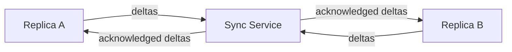

# 064 – Cloud Sync

**Document ID:** DEVOS-SPEC-064

**Version:** 0.1

**Status:** Draft

**Category:** Enterprise

**Depends On:**

- DEVOS-SPEC-006 – Terminology
- DEVOS-SPEC-011 – Domain Model
- DEVOS-SPEC-013 – Object Lifecycle
- DEVOS-SPEC-014 – State Model
- DEVOS-SPEC-020 – Workspace Specification
- DEVOS-SPEC-028 – Secret Specification
- DEVOS-SPEC-029 – Workspace Manifest
- DEVOS-SPEC-030 – System Architecture
- DEVOS-SPEC-031 – Workspace Engine
- DEVOS-SPEC-044 – Workspace Lifecycle
- DEVOS-SPEC-050 – SDK Overview

**Referenced By:**

- DEVOS-SPEC-029 – Workspace Manifest
- DEVOS-SPEC-031 – Workspace Engine
- DEVOS-SPEC-044 – Workspace Lifecycle
- DEVOS-SPEC-065 – Audit System

---

# Abstract

This document defines Cloud Sync, the forward-looking Enterprise capability that keeps Workspaces consistent across machines and team members through a synchronization service.

It defines the sync model over portable bundles and deltas, conflict handling, offline-first operation, secret exclusion, and sync-aware lifecycle coordination.

This specification is forward-looking: it activates only through an approved RFC and ADR and imposes no obligations on Version 0.1 implementations.

---

# Purpose

This specification answers the following question:

> **How do copies of one Workspace stay consistent across devices without violating local ownership or leaking secrets?**

Sync moves declarative state, never secrets and never authority.

Local operation remains primary; synchronization is an enhancement that reports Degraded honestly when unreachable.

Conflicts resolve into explicit reviewable outcomes, never silent merges.

---

# Goals

This specification aims to:

- Define synchronization as delta exchange grounded in the bundle contract of DEVOS-SPEC-029.
- Define identity mapping continuity across replicas.
- Define conflict detection and resolution semantics.
- Preserve Offline First behavior with honest degradation.
- Coordinate with lifecycle operations per DEVOS-SPEC-044.
- Exclude secret values from every synchronized byte.

---

# Non Goals

This specification does not define:

- Transport protocols, wire formats, or server architecture
- Real-time collaborative editing of open files
- Project source code hosting, which remains with external systems
- Secret value distribution of any kind
- Backup and restore products beyond lifecycle export/import

---

# Sync Model

Each replica holds one complete Workspace aggregate plus its identity mappings.

Rules:

- Deltas are declarative manifest fragments validated by the same pipeline stages as full manifests per DEVOS-SPEC-029.
- Identity mappings recorded at import persist across replicas so references stay resolvable everywhere, per DEVOS-SPEC-029.
- Every delta carries the correlation discipline end to end, joinable with events and logs per DEVOS-SPEC-055.
- Replicas synchronize only within their owning scope; cross-Workspace aggregation is structurally absent.

---

# Conflict Handling

Concurrent divergent changes produce conflicts requiring explicit resolution.

| Conflict Class        | Detection                                        | Resolution Posture                             |
| --------------------- | -------------------------------------------------- | ------------------------------------------------ |
| Concurrent mutation   | Two replicas change the same object before ack.     | Both versions preserved for review; no silent winner. |
| Lifecycle divergence  | One side activated while other archived.            | Lifecycle operations revalidated through DEVOS-SPEC-031. |
| Identifier remap      | Import remappings diverge between replicas.          | Mapping table reconciled before content merge.       |
| Reference breakage    | A delta removes a referenced object.                 | Delta rejected until dependent changes arrive.        |

Resolution is a human or policy decision expressed as new committed changes.

The engine applies resolutions through normal mutating operations, inheriting atomicity and event emission.

---

# Lifecycle Coordination

Sync-aware transitions extend the operational contract without changing it.

Rules:

- Mutating exclusivity extends across replicas: a mutation holding the Workspace claim anywhere blocks mutations everywhere, surfacing Busy consistently with DEVOS-SPEC-044.
- Archive and Delete propagate as acknowledged terminal states; Delete additionally enforces the permanent secret cutoff of DEVOS-SPEC-028 at every replica.
- Import from a synchronized bundle always yields an unvalidated Created draft locally, preserving trust rules of DEVOS-SPEC-044.
- Sync status participates in health reporting through the Health System per DEVOS-SPEC-046 as a Degraded contributor when unreachable.

---

# Offline Primacy

Synchronization never becomes a dependency.

Rules:

- All local capabilities remain fully functional offline, restating Rule 7 of SPECIFICATION_RULES.md.
- Queued outbound deltas persist durably and flush when connectivity returns.
- Stale replicas display their lag honestly rather than pretending freshness.
- Absence of the sync service degrades convenience, never correctness.

---

# Relationship to Version 0.1

Version 0.1 ships portability through Export and Import bundles alone, as defined by DEVOS-SPEC-029 and DEVOS-SPEC-044.

Cloud Sync layers continuous consistency on top.

Activation requires an RFC covering transport and service model, an approved ADR preserving aggregate invariants, and schema additions beside existing canonical schemas.

Until activated, implementations MUST NOT ship partial sync behavior.

---

# Enterprise Extension Invariants

The following invariants MUST hold when activated.

- Only declarative state synchronizes; raw secret values never leave secure custody.
- Every replica converges to the same validated aggregate or reports conflict honestly.
- Local operation never blocks on network availability.
- Conflicts always surface for explicit resolution; silence is a defect.
- Deleted Workspaces converge to deleted everywhere, with resolution permanently cut off.
- All sync administration and conflict resolutions are auditable per DEVOS-SPEC-065.

These MUST NOT break the single Workspace aggregate model.

---

# Security Requirements

When activated, this extension enforces:

- Bundle and delta payloads passing the Redaction Service of DEVOS-SPEC-036 before transmission.
- Mutual authentication between replicas and the sync service evaluated deny-by-default per DEVOS-SPEC-036.
- Full attribution of sync administrative acts through audit events per DEVOS-SPEC-065.
- Revalidation of all inbound deltas exactly like imported manifests per DEVOS-SPEC-029 trust rules.

---

# Future Extensions

Future specifications may add support for:

- Peer-to-peer sync topologies without central services
- Selective subtree synchronization for large aggregates
- Scheduled freeze windows aligned with organizational policies
- Cross-organization transfer flows under dual governance

These extensions require their own RFCs and ADRs and MUST preserve the invariants above.

---

# References

- DEVOS-SPEC-006 – Terminology
- DEVOS-SPEC-007 – Scope
- DEVOS-SPEC-011 – Domain Model
- DEVOS-SPEC-013 – Object Lifecycle
- DEVOS-SPEC-014 – State Model
- DEVOS-SPEC-020 – Workspace Specification
- SPECIFICATION_RULES.md – Repository rule set (Rule 7)
- DEVOS-SPEC-028 – Secret Specification
- DEVOS-SPEC-029 – Workspace Manifest
- DEVOS-SPEC-030 – System Architecture
- DEVOS-SPEC-031 – Workspace Engine
- DEVOS-SPEC-036 – Security Engine
- DEVOS-SPEC-044 – Workspace Lifecycle
- DEVOS-SPEC-046 – Health System
- DEVOS-SPEC-050 – SDK Overview
- DEVOS-SPEC-055 – API Specification
- DEVOS-SPEC-060 – Organizations
- DEVOS-SPEC-062 – RBAC
- DEVOS-SPEC-065 – Audit System

---

# Revision History

| Version | Date | Author             | Notes         |
| ------- | ---- | ------------------ | ------------- |
| 0.1     | TBD  | DevOS Contributors | Initial Draft |
