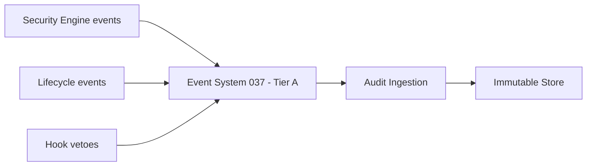

# 065 – Audit System

**Document ID:** DEVOS-SPEC-065

**Version:** 0.1

**Status:** Draft

**Category:** Enterprise

**Depends On:**

- DEVOS-SPEC-006 – Terminology
- DEVOS-SPEC-011 – Domain Model
- DEVOS-SPEC-014 – State Model
- DEVOS-SPEC-020 – Workspace Specification
- DEVOS-SPEC-028 – Secret Specification
- DEVOS-SPEC-030 – System Architecture
- DEVOS-SPEC-036 – Security Engine
- DEVOS-SPEC-037 – Event System
- DEVOS-SPEC-049 – Logging
- DEVOS-SPEC-055 – API Specification
- DEVOS-SPEC-060 – Organizations

**Referenced By:**

- DEVOS-SPEC-036 – Security Engine
- DEVOS-SPEC-037 – Event System
- DEVOS-SPEC-040 – CLI
- DEVOS-SPEC-057 – Events API
- DEVOS-SPEC-058 – CLI API
- DEVOS-SPEC-060 – Organizations
- DEVOS-SPEC-061 – Teams
- DEVOS-SPEC-062 – RBAC
- DEVOS-SPEC-063 – Policy Engine
- DEVOS-SPEC-064 – Cloud Sync

---

# Abstract

This document defines the Audit System, the forward-looking Enterprise capability that records, retains, and queries security-relevant activity across an organization.

It defines the audit record model, ingestion from Tier A events of the Event System defined in DEVOS-SPEC-037, retention and immutability duties, query surfaces, and export for external compliance consumers.

This specification is forward-looking: it activates only through an approved RFC and ADR and imposes no obligations on Version 0.1 implementations.

---

# Purpose

This specification answers the following question:

> **Who did what to which object, when, and how can that be proven later?**

Every security-relevant action already emits an event in Version 0.1.

The Audit System makes those events durable, searchable, immutable, and portable, turning transient signals into evidence.

---

# Goals

This specification aims to:

- Define the audit record as a durable superset of the event envelope.
- Define ingestion guarantees building on Tier A delivery.
- Define retention classes and immutability requirements.
- Define scoped query surfaces honoring authorization boundaries.
- Define export formats feeding external compliance tooling.
- Keep secret values absent from every record without exception.

---

# Non Goals

This specification does not define:

- Storage engine internals or database schemas
- Log aggregation for operational debugging, owned by DEVOS-SPEC-049
- Policy decision logic, owned by DEVOS-SPEC-063
- Legal-hold workflows beyond retention pinning
- Real-time alerting or incident-response orchestration

---

# Record Model

An audit record extends the event envelope with attribution completeness.

| Field            | Required | Description                                                   |
| ---------------- | -------- | --------------------------------------------------------------- |
| id               | Yes      | Immutable record identifier.                                     |
| timestamp        | Yes      | Authoritative ingestion time.                                    |
| actor            | Yes      | Identity responsible for the action, human or automation.         |
| action           | Yes      | What occurred, expressed through the originating topic taxonomy.   |
| objectRef        | Yes      | Workspace-scoped identifier of the affected object.               |
| workspaceScope   | Yes      | The Workspace inside which the action occurred.                   |
| outcome          | Yes      | Allowed, denied, vetoed, or failed.                               |
| correlationId    | Yes      | Join key across events, logs, and API calls per DEVOS-SPEC-055.    |
| metadata         | No       | Additional non-sensitive context from the source envelope.         |

Rules:

- Records are write-once; correction happens through explicit amendment records, never edits.
- Every record passes the Redaction Service of DEVOS-SPEC-036 before persistence.
- Record content MUST NEVER contain secret values, tokens, or credential material per DEVOS-SPEC-028.

---

# Ingestion

Ingestion builds on the durability tier already assigned by the Event System.

Rules:

- Tier A sources deliver at-least-once; ingestion deduplicates on record identifiers.
- Gaps between published and ingested sequences are detectable and reported honestly.
- Ingestion backpressure never suppresses source emission; it reports lag instead.
- Sources include security events, lifecycle transitions, permission grants and denials, hook vetoes, membership changes, policy decisions, and secret reveal moments surfaced by interfaces such as the CLI per DEVOS-SPEC-040.

---

# Retention and Immutability

Retention is classed, declared, and enforced mechanically.

| Retention Class | Applies To                                  | Obligation                                       |
| ---------------- | --------------------------------------------- | ---------------------------------------------------- |
| Standard         | Routine lifecycle and access records.          | Retained for the organization-declared period.        |
| Extended         | Secret operations, permission changes.          | Longer declared period; deletion requires dual approval. |
| Pinned           | Records under legal or investigative hold.     | Exempt from expiry until explicitly released.          |

Rules:

- Stored records are immutable; retention changes are themselves audited events.
- Deletion before expiry requires extended approval flows defined at activation time.
- Store compromise detection relies on record chaining; implementations SHOULD chain hashes across records so tampering is provable.

---

# Query and Export

Queries honor the same boundaries as every other surface.

Rules:

- Queries are authorized deny-by-default through the Security Engine per DEVOS-SPEC-036, scoped by organizational structure per DEVOS-SPEC-060.
- Query results carry no content beyond granted scope even when filters would otherwise match it.
- Exports produce self-describing bundles containing records plus chain verification material.
- Export flows are audited events themselves.
- Correlation joins against operational logs remain available within granted scopes, consistent with DEVOS-SPEC-049.

---

# Relationship to Version 0.1

Version 0.1 emits all necessary signals but retains nothing durably beyond implementation-chosen event retention.

The Audit System adds durable evidence on top.

Activation requires an RFC covering storage and retention commitments, an approved ADR preserving aggregate invariants, and schema additions beside existing canonical schemas.

Until activated, implementations SHOULD still treat Tier A events as durable-grade per DEVOS-SPEC-037.

---

# Enterprise Extension Invariants

The following invariants MUST hold when activated.

- Every security-relevant action yields exactly one attributable record.
- Records are immutable, redacted, and secret-free forever.
- Ingestion gaps are detectable; silence is a defect.
- Queries and exports never exceed granted authorization.
- Retention enforcement is mechanical, not advisory.
- Auditing remains available wherever the platform operates, degrading honestly offline.

These MUST NOT break the single Workspace aggregate model.

---

# Security Requirements

When activated, this extension enforces:

- Deny-by-default authorization over every query and export path per DEVOS-SPEC-036.
- Redaction at ingestion through the single choke point, restating DEVOS-SPEC-036 normatively.
- Absolute absence of secret values in any record, query result, or export bundle per DEVOS-SPEC-028.
- Full attribution of administrative acts on the audit system itself through its own records.

---

# Future Extensions

Future specifications may add support for:

- Streaming subscriptions over audit records for compliance pipelines
- Cryptographic anchoring to external transparency services
- Behavioral analytics over audit histories
- Cross-organization audit federation under dual governance

These extensions require their own RFCs and ADRs and MUST preserve the invariants above.

---

# References

- DEVOS-SPEC-006 – Terminology
- DEVOS-SPEC-007 – Scope
- DEVOS-SPEC-011 – Domain Model
- DEVOS-SPEC-014 – State Model
- DEVOS-SPEC-020 – Workspace Specification
- SPECIFICATION_RULES.md – Repository rule set (Rule 8)
- DEVOS-SPEC-028 – Secret Specification
- DEVOS-SPEC-030 – System Architecture
- DEVOS-SPEC-036 – Security Engine
- DEVOS-SPEC-037 – Event System
- DEVOS-SPEC-040 – CLI
- DEVOS-SPEC-049 – Logging
- DEVOS-SPEC-050 – SDK Overview
- DEVOS-SPEC-055 – API Specification
- DEVOS-SPEC-056 – Hooks API
- DEVOS-SPEC-057 – Events API
- DEVOS-SPEC-058 – CLI API
- DEVOS-SPEC-060 – Organizations
- DEVOS-SPEC-062 – RBAC
- DEVOS-SPEC-063 – Policy Engine

---

# Revision History

| Version | Date | Author             | Notes         |
| ------- | ---- | ------------------ | ------------- |
| 0.1     | TBD  | DevOS Contributors | Initial Draft |
