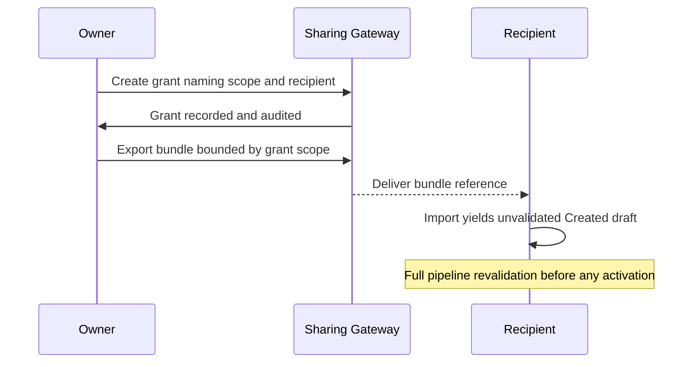

# 066 – Workspace Sharing

**Document ID:** DEVOS-SPEC-066

**Version:** 0.1

**Status:** Draft

**Category:** Enterprise

**Depends On:**

- DEVOS-SPEC-006 – Terminology
- DEVOS-SPEC-011 – Domain Model
- DEVOS-SPEC-013 – Object Lifecycle
- DEVOS-SPEC-020 – Workspace Specification
- DEVOS-SPEC-028 – Secret Specification
- DEVOS-SPEC-029 – Workspace Manifest
- DEVOS-SPEC-030 – System Architecture
- DEVOS-SPEC-036 – Security Engine
- DEVOS-SPEC-044 – Workspace Lifecycle
- DEVOS-SPEC-060 – Organizations

**Referenced By:**

- DEVOS-SPEC-061 – Teams
- DEVOS-SPEC-064 – Cloud Sync
- DEVOS-SPEC-070 – Marketplace

---

# Abstract

This document defines Workspace Sharing, the forward-looking Enterprise capability through which a Workspace owner grants controlled, revocable access to parties outside their normal administrative scope.

It defines share grants as first-class records, the bundle-based exchange model preserving references-not-secrets, recipient-side isolation, and revocation guarantees.

This specification is forward-looking: it activates only through an approved RFC and ADR and imposes no obligations on Version 0.1 implementations.

---

# Purpose

This specification answers the following question:

> **How does one person hand another party usable access to a Workspace without surrendering ownership or secrets?**

Sharing packages declared state into bundles governed by explicit grants.

Recipients receive what the grant names and nothing more.

Revocation ends future access without retroactively harming received copies beyond declared terms.

---

# Goals

This specification aims to:

- Define share grants with scope, purpose, and expiry.
- Define bundle exchange flows building on DEVOS-SPEC-029 round-trip guarantees.
- Enforce references-not-secrets across every shared artifact.
- Define recipient-side import under full revalidation.
- Define revocation semantics including grant-bound derived material.

---

# Non Goals

This specification does not define:

- Co-ownership or multi-owner aggregates
- Real-time collaborative editing
- Transfer of secret values in any encoding
- Public link sharing without identified recipients
- Marketplace distribution mechanics, deferred to DEVOS-SPEC-070

---

# Grant Model

A Share Grant is an auditable record binding a sharer, a recipient identity, a scope, and terms.

| Field       | Required | Description                                                     |
| ----------- | -------- | ----------------------------------------------------------------- |
| id          | Yes      | Stable grant identifier.                                           |
| sharer      | Yes      | The owning Actor acting within their authority.                     |
| recipient   | Yes      | Identified receiving Actor or Team per DEVOS-SPEC-061.              |
| scope       | Yes      | Declared subset: whole aggregate or named owned objects.            |
| rights      | Yes      | Receive-only, contribute-back, or review.                           |
| expiry      | No       | Optional time bound after which the grant is inert.                 |

Rules:

- Only the Workspace owner or explicitly delegated authority may create grants; delegation follows organizational rules per DEVOS-SPEC-060.
- Grants never transfer ownership; the aggregate keeps exactly one owner per DEVOS-SPEC-015.
- Scope narrowing is structural: excluded objects are absent from exchanged artifacts, not merely hidden.

---

# Exchange Guarantees

Exchange inherits every portability rule of the core.

Rules:

- Bundles obey export completeness and round-trip equivalence within the granted scope per DEVOS-SPEC-029.
- Raw secret values MUST NEVER enter any shared artifact, restating DEVOS-SPEC-028 normatively; recipients bind their own credentials afterward.
- Recipient imports always produce unvalidated Created drafts per DEVOS-SPEC-044 trust rules.
- Contribute-back rights return proposed changes as new bundles for owner-side review, never as direct writes.

---

# Revocation

Revocation ends future exercise of a grant.

Rules:

- Revoked grants stop all gateway-mediated access immediately upon commit.
- Expiry behaves identically to revocation at its deadline.
- Revocation is an auditable event attributable to its actor per DEVOS-SPEC-065.
- Copies already received by legitimate prior delivery remain governed by the terms recorded in the grant; the system makes no claim to reach into foreign environments.
- Sharers SHOULD treat sensitive scopes as assuming retention after first delivery and scope grants accordingly.

Honest limitation is part of the contract: this document promises control over the gateway, not confiscation elsewhere.

---

# Relationship to Version 0.1

Version 0.1 shares Workspaces through plain Export and Import between trusting parties.

Workspace Sharing adds governed, scoped, revocable exchange.

Activation requires an RFC covering gateway responsibilities, an approved ADR preserving aggregate invariants, and schema additions beside existing canonical schemas.

Until activated, implementations MUST NOT ship partial grant enforcement.

---

# Enterprise Extension Invariants

The following invariants MUST hold when activated.

- Every exchange traces to exactly one explicit grant.
- Grants never alter aggregate ownership.
- Shared artifacts contain zero secret values in any encoding.
- Recipient environments validate everything from scratch.
- Revocation and expiry take effect at the gateway without grace periods.
- All grant administration is auditable end to end.

These MUST NOT break the single Workspace aggregate model.

---

# Security Requirements

When activated, this extension enforces:

- Grant creation authority evaluated deny-by-default through the Security Engine per DEVOS-SPEC-036.
- Redaction verification over every outbound bundle through the single choke point per DEVOS-SPEC-036.
- Full attribution of grants, exchanges, and revocations through audit events per DEVOS-SPEC-065.
- Recipient-side treatment of inbound bundles as untrusted input until fully validated per DEVOS-SPEC-029.

---

# Future Extensions

Future specifications may add support for:

- Contribution review workflows with policy gating aligned with DEVOS-SPEC-063
- Time-boxed interactive sessions replacing static bundles
- Cross-organization sharing treaties under dual governance
- Watermarking and provenance marking for regulated exchange

These extensions require their own RFCs and ADRs and MUST preserve the invariants above.

---

# References

- DEVOS-SPEC-006 – Terminology
- DEVOS-SPEC-007 – Scope
- DEVOS-SPEC-011 – Domain Model
- DEVOS-SPEC-013 – Object Lifecycle
- DEVOS-SPEC-015 – Object Ownership
- DEVOS-SPEC-020 – Workspace Specification
- SPECIFICATION_RULES.md – Repository rule set (Rule 2)
- DEVOS-SPEC-028 – Secret Specification
- DEVOS-SPEC-029 – Workspace Manifest
- DEVOS-SPEC-030 – System Architecture
- DEVOS-SPEC-036 – Security Engine
- DEVOS-SPEC-044 – Workspace Lifecycle
- DEVOS-SPEC-060 – Organizations
- DEVOS-SPEC-061 – Teams
- DEVOS-SPEC-063 – Policy Engine
- DEVOS-SPEC-065 – Audit System
- DEVOS-SPEC-070 – Marketplace

---

# Revision History

| Version | Date | Author             | Notes         |
| ------- | ---- | ------------------ | ------------- |
| 0.1     | TBD  | DevOS Contributors | Initial Draft |
