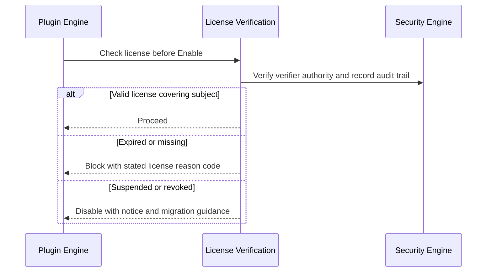

# 067 – License Management

**Document ID:** DEVOS-SPEC-067

**Version:** 0.1

**Status:** Draft

**Category:** Enterprise

**Depends On:**

- DEVOS-SPEC-006 – Terminology
- DEVOS-SPEC-011 – Domain Model
- DEVOS-SPEC-020 – Workspace Specification
- DEVOS-SPEC-026 – Plugin Specification
- DEVOS-SPEC-030 – System Architecture
- DEVOS-SPEC-032 – Plugin Engine
- DEVOS-SPEC-033 – Provider Engine
- DEVOS-SPEC-036 – Security Engine
- DEVOS-SPEC-047 – Settings
- DEVOS-SPEC-060 – Organizations

**Referenced By:**

- DEVOS-SPEC-070 – Marketplace

---

# Abstract

This document defines License Management, the forward-looking Enterprise capability that records, verifies, and enforces entitlements for commercial extensions and provider capacity inside DevOS.

It defines licenses as declarative artifacts, verification as a local-first check integrated with plugin enablement and provider readiness, and enforcement that degrades honestly rather than covertly.

This specification is forward-looking: it activates only through an approved RFC and ADR and imposes no obligations on Version 0.1 implementations.

---

# Purpose

This specification answers the following question:

> **How do paid extensions and metered capabilities express their terms without compromising user control or privacy?**

Licenses are data attached to extensions.

Verification happens locally against declared terms.

Enforcement is honest: unlicensed means disabled with a stated reason, never silently degraded or phoned home.

---

# Goals

This specification aims to:

- Define the license artifact and its required declarations.
- Define local verification integrated into existing engine gates.
- Define enforcement outcomes for expired, missing, and violated licenses.
- Preserve privacy: no telemetry obligation arises from licensing.
- Keep Offline First behavior intact for already-licensed operation.

---

# Non Goals

This specification does not define:

- Payment processing, billing, or invoicing
- Marketplace listing economics, deferred to DEVOS-SPEC-070
- Cryptographic license signing schemes; signatures follow the deferred roadmap of DEVOS-SPEC-032
- Antipiracy surveillance or user monitoring
- Open-source license compliance scanning

---

# License Artifact

A License binds one entitled subject to declared terms.

| Field       | Required | Description                                                        |
| ----------- | -------- | -------------------------------------------------------------------- |
| id          | Yes      | Stable license identifier.                                            |
| subject     | Yes      | The licensed extension identifier or provider capacity descriptor.     |
| holder      | Yes      | The Actor, Team per DEVOS-SPEC-061, or Organization per DEVOS-SPEC-060 holding the entitlement. |
| terms       | Yes      | Declared scope: seats, duration, capability bounds, renewal duties.    |
| status      | Yes      | Valid, expiring, expired, suspended, or revoked.                       |

Rules:

- Licenses live beside configuration as reviewable declarative state per Rule 5 of SPECIFICATION_RULES.md.
- Status transitions occur through verifiable operations, never silent timer mutation alone.
- Terms declare everything enforcement needs; undocumented expectations are invalid.

---

# Verification and Enforcement

Verification integrates into gates that already exist.

Rules:

- The Plugin Engine consults licenses at install, enable, and update per DEVOS-SPEC-032.
- The Provider Engine treats lapsed capacity licenses like quota exhaustion, reporting Degraded honestly per DEVOS-SPEC-052.
- Enforcement outcomes surface through normal error channels with stable reason codes, never through covert behavior changes.
- Verification completes locally for already-valid licenses; connectivity remains an optional refresh enhancement per Rule 7 of SPECIFICATION_RULES.md.

---

# Privacy Stance

Licensing introduces no surveillance.

Rules:

- No telemetry obligation arises from any license term, consistent with the disabled-by-default telemetry stance of DEVOS-SPEC-047.
- Verification MUST NOT transmit usage details, workspace content, or identity information beyond what explicit activation flows define.
- Holders MAY inspect every stored license and its verification history.
- All licensing administration is auditable through the direction of DEVOS-SPEC-065.

Vendors needing deeper attestation must win that through future ADRs, not through this document.

---

# Relationship to Version 0.1

Version 0.1 contains only free extensions, so licensing has nothing to govern.

This document prepares the contract ahead of commercial distribution.

Activation requires an RFC covering artifact format and gate integration, an approved ADR preserving aggregate invariants, and schema additions beside existing canonical schemas.

Until activated, implementations MUST NOT ship partial licensing behavior.

---

# Enterprise Extension Invariants

The following invariants MUST hold when activated.

- Every enforcement outcome states its license reason openly.
- Validly licensed operation never requires connectivity.
- Licensing creates no telemetry obligations and transmits no usage data by default.
- License state is reviewable declarative data held by its holder.
- Enforcement integrates only at existing engine gates.
- Revocation disables future use without destroying user-owned Workspaces or data.

These MUST NOT break the single Workspace aggregate model.

---

# Security Requirements

When activated, this extension enforces:

- Verifier authority delegated explicitly by the Security Engine per DEVOS-SPEC-036 with deny-by-default administration.
- Attribution of all licensing administration through audit events per DEVOS-SPEC-065.
- Integrity protection over stored licenses so tampering is detectable, strengthening toward signed artifacts as the deferred signature roadmap matures.
- No storage of credential material inside license artifacts per DEVOS-SPEC-028.

---

# Future Extensions

Future specifications may add support for:

- Signed license artifacts aligned with marketplace attestation in DEVOS-SPEC-070
- Seat pooling across organizations under dual governance
- Usage-metered entitlements fed by explicit consent flows
- Compliance exports for procurement systems

These extensions require their own RFCs and ADRs and MUST preserve the invariants above.

---

# References

- DEVOS-SPEC-000 – Specification Governance
- DEVOS-SPEC-006 – Terminology
- DEVOS-SPEC-007 – Scope
- DEVOS-SPEC-011 – Domain Model
- SPECIFICATION_RULES.md – Repository rule set (Rules 5, 7)
- DEVOS-SPEC-020 – Workspace Specification
- DEVOS-SPEC-026 – Plugin Specification
- DEVOS-SPEC-028 – Secret Specification
- DEVOS-SPEC-030 – System Architecture
- DEVOS-SPEC-032 – Plugin Engine
- DEVOS-SPEC-033 – Provider Engine
- DEVOS-SPEC-036 – Security Engine
- DEVOS-SPEC-047 – Settings
- DEVOS-SPEC-050 – SDK Overview
- DEVOS-SPEC-052 – Provider SDK
- DEVOS-SPEC-060 – Organizations
- DEVOS-SPEC-061 – Teams
- DEVOS-SPEC-065 – Audit System
- DEVOS-SPEC-070 – Marketplace

---

# Revision History

| Version | Date | Author             | Notes         |
| ------- | ---- | ------------------ | ------------- |
| 0.1     | TBD  | DevOS Contributors | Initial Draft |
