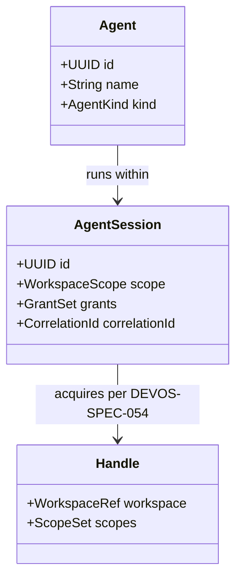
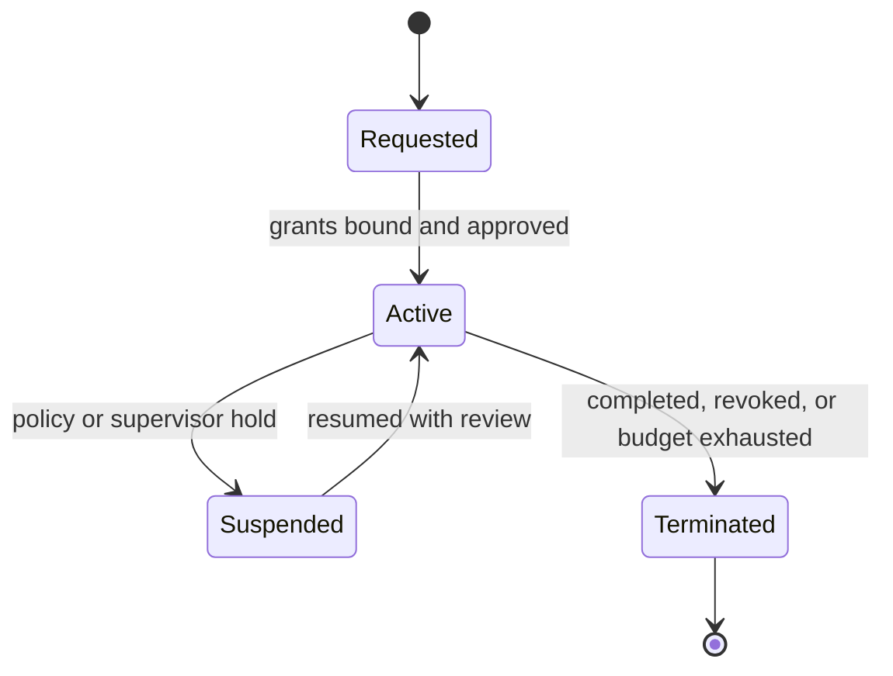

# 068 – Remote Agents

**Document ID:** DEVOS-SPEC-068

**Version:** 0.1

**Status:** Draft

**Category:** Enterprise

**Depends On:**

- DEVOS-SPEC-006 – Terminology
- DEVOS-SPEC-011 – Domain Model
- DEVOS-SPEC-014 – State Model
- DEVOS-SPEC-020 – Workspace Specification
- DEVOS-SPEC-026 – Plugin Specification
- DEVOS-SPEC-028 – Secret Specification
- DEVOS-SPEC-030 – System Architecture
- DEVOS-SPEC-031 – Workspace Engine
- DEVOS-SPEC-036 – Security Engine
- DEVOS-SPEC-039 – AI Router
- DEVOS-SPEC-054 – Workspace SDK
- DEVOS-SPEC-055 – API Specification
- DEVOS-SPEC-060 – Organizations

**Referenced By:**

- DEVOS-SPEC-039 – AI Router
- DEVOS-SPEC-054 – Workspace SDK
- DEVOS-SPEC-071 – AI Agents

---

# Abstract

This document defines Remote Agents, the forward-looking Enterprise capability through which autonomous software actors operate on Workspaces from remote execution environments under full platform governance.

It defines agent identity, least-privilege handle acquisition through the Workspace SDK, session boundaries, observability duties, and termination guarantees.

Agents are actors, never insiders: they hold exactly the authority granted to them, evaluated by the same kernel as every other caller.

This specification is forward-looking: it activates only through an approved RFC and ADR and imposes no obligations on Version 0.1 implementations.

---

# Purpose

This specification answers the following question:

> **How can autonomous agents work on real Workspaces productively while every guarantee humans depend on keeps holding?**

Agents receive scoped handles, traverse identical validation and authorization gates, produce fully correlated traces, and die cleanly when their sessions end.

Nothing about an agent is privileged; everything about an agent is attributable.

---

# Goals

This specification aims to:

- Define the agent actor model with durable identity.
- Define session lifecycle from request to guaranteed teardown.
- Define authority acquisition exclusively through SDK handles per DEVOS-SPEC-054.
- Define observability parity so agent work is as traceable as human work.

---

# Non Goals

This specification does not define:

- Agent reasoning, planning, or model internals
- Hosting infrastructure for remote execution environments
- Consumer agent behaviors and marketplace distribution, deferred to DEVOS-SPEC-071 and DEVOS-SPEC-070
- Autonomous approval of its own permission expansions

---

# Actor Model

An Agent is a non-human actor with durable identity inside one organizational scope.

Rules:

- Agent identity is distinct from every human Actor; attribution always names the responsible principal.
- Grants attach to sessions, never to identities alone, keeping blast radius bounded per run.
- One session operates on exactly one Workspace scope, mirroring handle discipline.

---

# Session Lifecycle

Sessions are explicit, bounded, and terminable.

Rules:

- Activation requires explicitly granted capabilities evaluated deny-by-default through the Security Engine per DEVOS-SPEC-036.
- Sessions carry budgets: wall-clock, operation-count, or resource bounds declared at request time.
- Suspension holds locks nowhere and resumption re-evaluates every grant before any further effect.
- Termination is guaranteed: on completion, revocation, budget exhaustion, or fault, handles invalidate and in-flight mutations resolve to their transactional outcomes per DEVOS-SPEC-031 atomicity.
- Hook vetoes apply to agent-initiated operations identically, including dedicated interception where organizations require review per DEVOS-SPEC-056.

---

# Authority Acquisition

Agents touch Workspaces only through the same programmatic surface as any other external code.

| Rule               | Requirement                                                                     |
| ------------------ | --------------------------------------------------------------------------------- |
| SDK-only access    | All manipulation flows through Core-tier handles per DEVOS-SPEC-054.               |
| No self-grant      | Agents MUST NOT expand their own grants mid-session under any circumstance.        |
| Deny-by-default    | Every capability request resolves through the kernel identically per DEVOS-SPEC-036.|
| Secret transience  | Any authorized resolution remains transient and secret values never persist per DEVOS-SPEC-028. |
| Policy obedience   | Organizational policies gate agent operations exactly as they gate human ones per DEVOS-SPEC-063. |

Escalation requests are workflow events requiring human approval, never executable paths.

---

# Observability Parity

Agent work leaves the same evidentiary trail as human work.

Rules:

- Every session carries one root correlation identifier propagated across API calls, events, hooks, and logs per DEVOS-SPEC-055 and DEVOS-SPEC-049.
- Lifecycle transitions, denials, vetoes, and terminations emit auditable events feeding DEVOS-SPEC-065.
- Memory interactions respect the privacy rules of DEVOS-SPEC-038, and AI consumption flows through the Router with honest usage reporting per DEVOS-SPEC-039.

Supervisors answer who, what, and why for any agent action using standard traces alone.

---

# Relationship to Version 0.1

Version 0.1 has no autonomous actors; automation arrives only as local workflows and plugins under direct invocation.

Remote Agents add governed autonomy.

Activation requires an RFC covering identity and hosting boundaries, an approved ADR preserving aggregate invariants, and schema additions beside existing canonical schemas.

Until activated, implementations MUST NOT ship partial agent behavior.

---

# Enterprise Extension Invariants

The following invariants MUST hold when activated.

- Agents are principals with identity, never anonymous extensions of humans.
- Authority exists only within explicit, bounded, revocable sessions.
- No path bypasses engine gates, hook vetoes, or policy evaluation.
- Every agent action is correlated and auditable end to end.
- Termination guarantees hold under fault, revocation, and abandonment alike.
- Agents cannot outlive their sessions' grants.

These MUST NOT break the single Workspace aggregate model.

---

# Security Requirements

When activated, this extension enforces:

- Session establishment and every grant evaluation through deny-by-default checks per DEVOS-SPEC-036.
- Full audit attribution naming the acting agent, its session, and its requesting principal per DEVOS-SPEC-065.
- Containment of compromised agents through immediate suspension semantics without partial-transition residue per DEVOS-SPEC-031.
- Zero ambient secret access; custody rules of DEVOS-SPEC-028 bind agents absolutely.

---

# Future Extensions

Future specifications may add support for:

- Multi-agent coordination protocols under shared supervision
- Delegated approval chains for escalation workflows
- Sandboxed execution profiles with graded isolation aligned with plugin roadmap directions
- Cross-workspace orchestration under explicit multi-aggregate governance ADRs

These extensions require their own RFCs and ADRs and MUST preserve the invariants above.

---

# References

- DEVOS-SPEC-006 – Terminology
- DEVOS-SPEC-007 – Scope
- DEVOS-SPEC-011 – Domain Model
- DEVOS-SPEC-014 – State Model
- DEVOS-SPEC-020 – Workspace Specification
- DEVOS-SPEC-026 – Plugin Specification
- DEVOS-SPEC-028 – Secret Specification
- DEVOS-SPEC-030 – System Architecture
- DEVOS-SPEC-031 – Workspace Engine
- DEVOS-SPEC-036 – Security Engine
- DEVOS-SPEC-038 – Memory Engine
- DEVOS-SPEC-039 – AI Router
- DEVOS-SPEC-049 – Logging
- DEVOS-SPEC-054 – Workspace SDK
- DEVOS-SPEC-055 – API Specification
- DEVOS-SPEC-056 – Hooks API
- DEVOS-SPEC-060 – Organizations
- DEVOS-SPEC-063 – Policy Engine
- DEVOS-SPEC-065 – Audit System
- DEVOS-SPEC-070 – Marketplace
- DEVOS-SPEC-071 – AI Agents

---

# Revision History

| Version | Date | Author             | Notes         |
| ------- | ---- | ------------------ | ------------- |
| 0.1     | TBD  | DevOS Contributors | Initial Draft |
