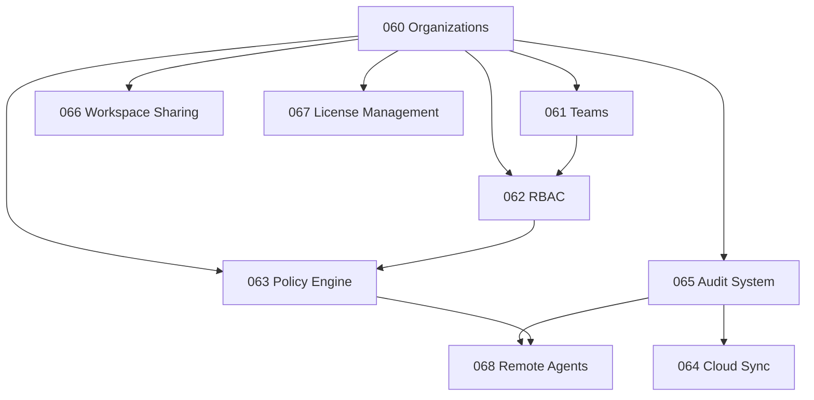

# 069 – Enterprise Roadmap

**Document ID:** DEVOS-SPEC-069

**Version:** 0.1

**Status:** Draft

**Category:** Enterprise

**Depends On:**

- DEVOS-SPEC-000 – Specification Governance
- DEVOS-SPEC-006 – Terminology
- DEVOS-SPEC-007 – Scope
- DEVOS-SPEC-011 – Domain Model
- DEVOS-SPEC-030 – System Architecture
- DEVOS-SPEC-060 – Organizations
- DEVOS-SPEC-061 – Teams
- DEVOS-SPEC-062 – RBAC
- DEVOS-SPEC-063 – Policy Engine
- DEVOS-SPEC-064 – Cloud Sync
- DEVOS-SPEC-065 – Audit System
- DEVOS-SPEC-066 – Workspace Sharing
- DEVOS-SPEC-067 – License Management
- DEVOS-SPEC-068 – Remote Agents

**Referenced By:**

- DEVOS-SPEC-078 – V2 Roadmap
- DEVOS-SPEC-079 – Future Vision

---

# Abstract

This document defines the Enterprise Roadmap: the activation order, dependency structure, and governance path for the Enterprise range DEVOS-SPEC-060 through DEVOS-SPEC-068.

Every Enterprise capability is forward-looking and excluded from Version 0.1 scope per DEVOS-SPEC-007.

This roadmap sequences their activation so each lands on stable foundations, and it restates the invariants every activation MUST preserve.

It is a planning instrument, not an obligation.

---

# Purpose

This specification answers the following question:

> **In what order do Enterprise capabilities activate, what does each depend on, and what must never break along the way?**

Activation proceeds from identity structure outward to autonomy, so that by the time agents act, roles, policies, audit, and sharing already exist beneath them.

---

# Goals

This specification aims to:

- Sequence Enterprise capabilities into coherent phases.
- Record the dependency graph among them.
- Fix the common activation checklist every capability shares.
- Restate the invariant floor no activation may violate.

---

# Non Goals

This specification does not define:

- Timelines, dates, or release commitments
- Pricing or packaging of enterprise offerings
- Consumer-range futures, owned by the Future range DEVOS-SPEC-070 through DEVOS-SPEC-079
- Implementation project plans

---

# Dependency Structure

Enterprise capabilities build on one another in layers.

Reading the graph:

- Organizations anchor everything; membership precedes authority.
- Teams refine scope before RBAC consumes it.
- The Policy Engine needs both structure and role vocabulary.
- Audit must exist before sync conflicts, license revocations, or agent sessions demand evidence.
- Remote Agents sit last because they consume every guarantee below.

---

# Phases

| Phase   | Capabilities                     | Theme                                                        |
| ------- | ---------------------------------- | ---------------------------------------------------------------- |
| Phase 1 | 060, 061, 065                      | Identity structure and evidence foundation.                       |
| Phase 2 | 062, 063                           | Delegated authority and declarative control.                      |
| Phase 3 | 064, 066, 067                      | Consistency, controlled exchange, and commercial participation.   |
| Phase 4 | 068                                | Governed autonomy on top of everything prior.                      |

Phases gate only through dependency completeness, not through calendar time.

A capability MAY activate early only when its unmet dependencies are explicitly waived through its own ADR with compensating guarantees named.

---

# Common Activation Checklist

Every Enterprise capability activates through the identical path.

| Step | Requirement                                                                  |
| ---- | -------------------------------------------------------------------------------- |
| 1    | RFC describing adoption surface, user impact, and migration story.               |
| 2    | ADR confirming no violation of aggregate invariants and naming dependencies.     |
| 3    | Schema additions living beside existing canonical schemas under the reserved namespace. |
| 4    | Specification updated from forward-looking Draft to Active status.                |
| 5    | Conformance criteria published before implementations ship.                        |

Partial behavior outside an activated specification is prohibited for conformant implementations.

---

# Invariant Floor

No activation, ever, may cross this floor.

- Exactly one owner exists for every Workspace; collectives administer but never co-own, per DEVOS-SPEC-015.
- Deny-by-default authorization remains absolute through the Security Engine per DEVOS-SPEC-036.
- Raw secret values never leave secure custody, per DEVOS-SPEC-028.
- Local Workspaces operate fully offline regardless of enterprise context, per Rule 7 of SPECIFICATION_RULES.md.
- Every security-relevant act remains attributable through events feeding audit direction, per DEVOS-SPEC-037.
- Plugins extend without modifying the core, per Rule 6 of SPECIFICATION_RULES.md.

Any proposal conflicting with this floor requires amending these foundations first, never routing around them.

---

# Relationship to Version 0.1

Version 0.1 remains fully implementable and valuable with none of this range active.

The Enterprise range exists so organizations can adopt DevOS deeply when ready, on top of the same core everyone else runs.

Nothing here gates core conformance, and core evolution MUST NOT require enterprise activation.

---

# Enterprise Roadmap Invariants

The following invariants MUST always hold.

- Activation follows the checklist without exception.
- Dependencies are honored or explicitly waived through ADRs.
- Phases gate on readiness, never on dates.
- The invariant floor binds every phase permanently.
- Core specifications evolve independently of enterprise status.

---

# Security Requirements

This roadmap itself enforces:

- That no activation sequence can create authority paths ahead of their audit trail.
- That every checklist artifact remains public, reviewable, and versioned within this repository.

---

# Future Extensions

Future revisions of this roadmap may add support for:

- Additional Enterprise capabilities proposed through new numbered specifications
- Revised sequencing driven by implementation feedback
- Explicit deprecation of capabilities that fail adoption

Changes follow DEVOS-SPEC-000 governance and never retroactively alter activated capabilities except through their own processes.

---

# References

- DEVOS-SPEC-000 – Specification Governance
- DEVOS-SPEC-006 – Terminology
- DEVOS-SPEC-007 – Scope
- DEVOS-SPEC-011 – Domain Model
- SPECIFICATION_RULES.md – Repository rule set (Rules 2, 6, 7)
- DEVOS-SPEC-015 – Object Ownership
- DEVOS-SPEC-028 – Secret Specification
- DEVOS-SPEC-030 – System Architecture
- DEVOS-SPEC-031 – Workspace Engine
- DEVOS-SPEC-036 – Security Engine
- DEVOS-SPEC-037 – Event System
- DEVOS-SPEC-060 – Organizations
- DEVOS-SPEC-061 – Teams
- DEVOS-SPEC-062 – RBAC
- DEVOS-SPEC-063 – Policy Engine
- DEVOS-SPEC-064 – Cloud Sync
- DEVOS-SPEC-065 – Audit System
- DEVOS-SPEC-066 – Workspace Sharing
- DEVOS-SPEC-067 – License Management
- DEVOS-SPEC-068 – Remote Agents
- DEVOS-SPEC-078 – V2 Roadmap
- DEVOS-SPEC-079 – Future Vision

---

# Revision History

| Version | Date | Author             | Notes         |
| ------- | ---- | ------------------ | ------------- |
| 0.1     | TBD  | DevOS Contributors | Initial Draft |
