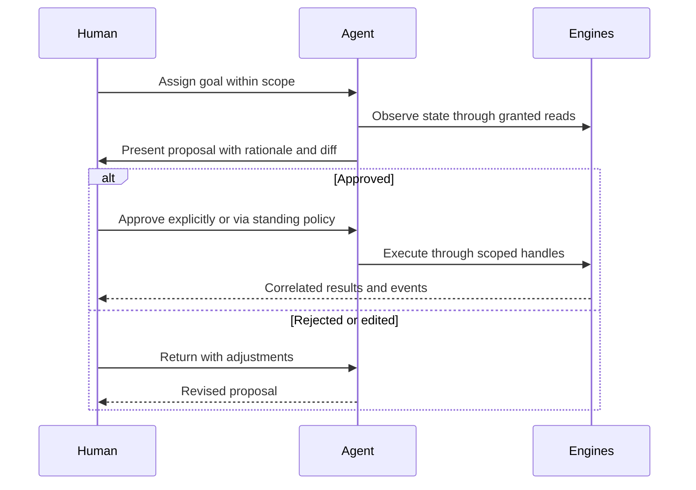

# 071 – AI Agents

**Document ID:** DEVOS-SPEC-071

**Version:** 0.1

**Status:** Draft

**Category:** Future

**Depends On:**

- DEVOS-SPEC-006 – Terminology
- DEVOS-SPEC-011 – Domain Model
- DEVOS-SPEC-014 – State Model
- DEVOS-SPEC-020 – Workspace Specification
- DEVOS-SPEC-030 – System Architecture
- DEVOS-SPEC-038 – Memory Engine
- DEVOS-SPEC-039 – AI Router
- DEVOS-SPEC-050 – SDK Overview
- DEVOS-SPEC-054 – Workspace SDK
- DEVOS-SPEC-068 – Remote Agents

**Referenced By:**

- DEVOS-SPEC-068 – Remote Agents
- DEVOS-SPEC-072 – Research Platform
- DEVOS-SPEC-079 – Future Vision

---

# Abstract

This document defines AI Agents as the consumer-facing future of autonomous assistance inside DevOS Workspaces.

Where Remote Agents in DEVOS-SPEC-068 govern enterprise-operated autonomy, this document describes the broader agent ecosystem: assistant-grade agents that observe, propose, and act within Workspaces under identical platform governance.

It defines capability tiers for agents, interaction contracts with humans, and the boundaries that keep agency beneficial.

This specification is forward-looking and activates only through an approved RFC and ADR.

---

# Purpose

This specification answers the following question:

> **What should agents be able to do inside a Workspace, and what must they never do regardless of capability?**

Agents climb a capability ladder from observation through proposal to bounded action.

Every rung inherits the same authorization kernel, event trail, and human-first defaults.

Autonomy is earned per grant, never assumed per model.

---

# Goals

This specification aims to:

- Define the agent capability ladder with explicit rungs.
- Define human interaction contracts including proposal review.
- Define memory and context duties through existing engines.
- Define evaluation boundaries that keep behavior auditable.
- Preserve Human First primacy over autonomous action.

---

# Non Goals

This specification does not define:

- Model architectures, prompting techniques, or training methods
- Enterprise session infrastructure, owned by DEVOS-SPEC-068
- Research experimentation processes, owned by DEVOS-SPEC-072
- Marketplace distribution mechanics, deferred to DEVOS-SPEC-070
- General-purpose autonomy beyond declared Workspace scope

---

# Capability Ladder

Agent power is tiered, and each tier binds to distinct authority.

| Tier | Name        | Capabilities                                            | Authority Path                          |
| ---- | ----------- | --------------------------------------------------------- | ----------------------------------------- |
| 1    | Observer    | Read states, subscribe to events, answer questions.       | Event subscriptions per DEVOS-SPEC-057.   |
| 2    | Proposer    | Draft configurations, manifests, and workflow definitions. | Core-tier read plus proposal artifacts.  |
| 3    | Operator    | Execute approved mutations within granted scopes.          | SDK handles per DEVOS-SPEC-054.          |
| 4    | Collaborator | Long-lived bounded sessions across tasks.                 | Session discipline of DEVOS-SPEC-068.    |

Rules:

- Tiers compose: an Operator holds Observer rights implicitly but nothing beyond its grants.
- Promotion between tiers is an administrative act evaluated deny-by-default per DEVOS-SPEC-036.
- Tier 4 requires the full enterprise session machinery; no consumer shortcut exists.

---

# Human Interaction Contracts

Agents serve people; the contracts keep it that way.

Rules:

- Proposals are declarative artifacts, never direct writes awaiting rubber stamps after the fact.
- Standing approval policies MAY pre-authorize narrow operation classes through DEVOS-SPEC-063 once activated.
- Agents MUST surface uncertainty honestly rather than fabricating confidence.
- Every interaction joins the correlation trail so reviews reconstruct full reasoning context.

---

# Memory and Context Duties

Agent effectiveness depends on disciplined memory use.

Rules:

- Context augmentation flows exclusively through the Memory Engine per DEVOS-SPEC-038, honoring ownership and privacy rules.
- AI capability consumption flows through the Router with honest usage reporting per DEVOS-SPEC-039.
- Agents MUST NOT exfiltrate memory content outside their granted scopes.
- Forgetting duties apply to agents identically: expired or revoked contexts stop influencing behavior.

---

# Evaluation Boundaries

Behavioral quality is out of scope; behavioral accountability is in scope.

Rules:

- All agent actions traverse standard gates: validation pipelines, hooks, policies, and permission checks unchanged.
- Failures map to Failed or Suspended states per DEVOS-SPEC-014 without inventing new ones.
- Repetition limits and budget bounds prevent runaway loops at session level.
- Audit trails name the acting agent, its requesting principal, and its grants per the direction of DEVOS-SPEC-065.

---

# Relationship to Version 0.1

Version 0.1 includes the AI Router and Memory Engine but no autonomous actors.

This document sketches how agency arrives without disturbing foundations.

Activation requires an RFC covering the ladder's adoption surface, an approved ADR preserving aggregate invariants, and schema additions beside existing canonical schemas.

Until activated, implementations MUST NOT ship partial agent behavior.

---

# Future Extension Invariants

The following invariants MUST hold when activated.

- No agent acts outside explicitly granted scopes, whatever its capabilities.
- Humans approve consequential changes unless standing policy says otherwise, and policy itself is human-authored.
- Agents use the same doors as every other caller; no privileged paths exist.
- Attribution names agents on every observable trace.
- Autonomy never outruns auditability.

These MUST NOT break the single Workspace aggregate model.

---

# Security Requirements

When activated, this extension enforces:

- Deny-by-default evaluation of every agent capability request per DEVOS-SPEC-036.
- Transient-only secret resolution where authorized, with custody rules of DEVOS-SPEC-028 binding absolutely.
- Full attribution through events feeding DEVOS-SPEC-065.
- Termination guarantees inherited from session discipline per DEVOS-SPEC-068.

---

# Future Extensions

Future specifications may add support for:

- Multi-agent negotiation protocols under shared supervision
- Skill packaging formats distributed via DEVOS-SPEC-070
- Formal verification hooks for safety-critical operations
- Cross-workspace collaboration under multi-aggregate governance ADRs

These extensions require their own RFCs and ADRs and MUST preserve the invariants above.

---

# References

- DEVOS-SPEC-000 – Specification Governance
- DEVOS-SPEC-006 – Terminology
- DEVOS-SPEC-007 – Scope
- DEVOS-SPEC-011 – Domain Model
- DEVOS-SPEC-014 – State Model
- DEVOS-SPEC-020 – Workspace Specification
- SPECIFICATION_RULES.md – Repository rule set (Rule 20)
- DEVOS-SPEC-028 – Secret Specification
- DEVOS-SPEC-030 – System Architecture
- DEVOS-SPEC-036 – Security Engine
- DEVOS-SPEC-037 – Event System
- DEVOS-SPEC-038 – Memory Engine
- DEVOS-SPEC-039 – AI Router
- DEVOS-SPEC-050 – SDK Overview
- DEVOS-SPEC-054 – Workspace SDK
- DEVOS-SPEC-055 – API Specification
- DEVOS-SPEC-057 – Events API
- DEVOS-SPEC-063 – Policy Engine
- DEVOS-SPEC-065 – Audit System
- DEVOS-SPEC-068 – Remote Agents
- DEVOS-SPEC-070 – Marketplace
- DEVOS-SPEC-072 – Research Platform
- DEVOS-SPEC-079 – Future Vision

---

# Revision History

| Version | Date | Author             | Notes         |
| ------- | ---- | ------------------ | ------------- |
| 0.1     | TBD  | DevOS Contributors | Initial Draft |
