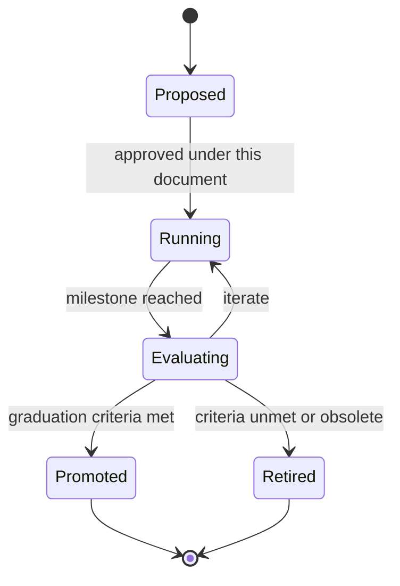

# 072 – Research Platform

**Document ID:** DEVOS-SPEC-072

**Version:** 0.1

**Status:** Draft

**Category:** Future

**Depends On:**

- DEVOS-SPEC-000 – Specification Governance
- DEVOS-SPEC-006 – Terminology
- DEVOS-SPEC-007 – Scope
- DEVOS-SPEC-020 – Workspace Specification
- DEVOS-SPEC-030 – System Architecture
- DEVOS-SPEC-038 – Memory Engine
- DEVOS-SPEC-050 – SDK Overview
- DEVOS-SPEC-059 – Versioning Policy

**Referenced By:**

- DEVOS-SPEC-071 – AI Agents
- DEVOS-SPEC-077 – Ecosystem
- DEVOS-SPEC-079 – Future Vision

---

# Abstract

This document defines the Research Platform, the forward-looking framework for incubating experimental capabilities without endangering the stability of the specification set.

It defines the experiment lifecycle, isolation boundaries between research and normative surfaces, promotion criteria into stable specifications, and retirement duties for failed experiments.

Research moves fast because it touches nothing load-bearing.

This specification is forward-looking and activates only through an approved RFC and ADR.

---

# Purpose

This specification answers the following question:

> **How does DevOS innovate boldly while keeping every guarantee users rely on intact?**

Experiments live in explicitly marked spaces with no authority over core behavior.

Successful experiments graduate through normal governance; failed ones exit cleanly leaving traces only in history.

Stability and exploration stop being enemies through structural separation.

---

# Goals

This specification aims to:

- Define the experiment lifecycle from proposal to outcome.
- Define isolation requirements keeping research off normative paths.
- Define promotion criteria and the graduation checklist.
- Define data and privacy duties for research participants.
- Define clean retirement for concluded experiments.

---

# Non Goals

This specification does not define:

- Specific research agendas or hypotheses
- Model training or benchmarking methodologies
- Agent capability design, owned by DEVOS-SPEC-071
- Production feature development, which follows Rule 1 flow
- Publication or academic processes

---

# Experiment Lifecycle

Every experiment follows one trackable path.

Rules:

- Proposals name their hypothesis, surface under test, success measures, and blast radius before approval.
- Running experiments carry visible Experimental markings per the stability ladder of DEVOS-SPEC-050.
- Evaluation compares outcomes against pre-declared measures, not post-hoc narratives.
- Both exits are honorable; the platform records outcomes either way.

---

# Isolation Boundaries

Experiments earn freedom by staying contained.

| Boundary          | Requirement                                                                  |
| ----------------- | ------------------------------------------------------------------------------ |
| Surface isolation | Experimental capabilities live behind explicit opt-in, never default-on.        |
| Data isolation    | Research data stores remain separate from Workspace declarative state.          |
| Authority ceiling | Experiments receive only deny-by-default grants identical to plugins.           |
| Performance floor | Experiment overhead MUST NOT degrade non-participating operations measurably.   |
| Exit readiness    | Removal at any time leaves Workspaces valid and users uninjured.                |

An experiment that cannot honor these boundaries is not an experiment; it is a change proposal requiring the full RFC and ADR path per DEVOS-SPEC-000.

---

# Promotion Criteria

Graduation turns research into specification.

Checklist:

| Criterion            | Evidence Required                                                   |
| -------------------- | --------------------------------------------------------------------- |
| Real problem solved  | Demonstrated need aligned with contribution principles of SPECIFICATION_RULES.md. |
| Deterministic enough | Behavior reproducible across conformant implementations.               |
| Security reviewed    | Threat model updated without weakening DEVOS-SPEC-036 posture.         |
| Migration designed   | Path from experimental usage to stable usage documented.               |
| Governance ready     | RFC and ADR prepared per the common activation discipline.             |

Promotion lands through the standard numbered-specification process, never by mutating this document into a permanent home.

---

# Participant Duties

Human subjects and their workspaces deserve protection.

Rules:

- Participation is explicit, revocable, and informed.
- Memory content used in research honors the ownership and privacy rules of DEVOS-SPEC-038 without exception.
- Secret values NEVER enter research datasets, restating DEVOS-SPEC-028 absolutely.
- Telemetry beyond existing defaults requires separate consent flows consistent with DEVOS-SPEC-047 stances.

---

# Relationship to Version 0.1

Version 0.1 channels all change through RFCs and ADRs directly, with Experimental rungs available on SDK surfaces per DEVOS-SPEC-050.

The Research Platform adds structure for heavier experimentation ahead.

Activation requires an RFC covering its operating model, an approved ADR preserving aggregate invariants, and schema additions beside existing canonical schemas.

Until activated, implementations SHOULD use the existing stability ladder as the sole experimentation channel.

---

# Future Extension Invariants

The following invariants MUST hold when activated.

- No experiment ever bypasses engine gates, validation pipelines, or authorization.
- Opt-in remains the only participation path.
- Every experiment declares its exit before it begins.
- Graduation flows exclusively through normal governance.
- Retirement removes all residual state within declared windows.

These MUST NOT break the single Workspace aggregate model.

---

# Security Requirements

When activated, this extension enforces:

- Grant ceilings identical to plugin evaluation per DEVOS-SPEC-036.
- Absolute exclusion of secret material from research data per DEVOS-SPEC-028.
- Attribution of experiment administration and participation changes through audit direction per DEVOS-SPEC-065.

---

# Future Extensions

Future specifications may add support for:

- Federated research across organizations under dual governance
- Standardized evaluation harnesses shared by the ecosystem
- Longitudinal studies over auditable operational histories

These extensions require their own RFCs and ADRs and MUST preserve the invariants above.

---

# References

- DEVOS-SPEC-000 – Specification Governance
- DEVOS-SPEC-006 – Terminology
- DEVOS-SPEC-007 – Scope
- SPECIFICATION_RULES.md – Repository rule set (Rule 1)
- DEVOS-SPEC-020 – Workspace Specification
- DEVOS-SPEC-028 – Secret Specification
- DEVOS-SPEC-030 – System Architecture
- DEVOS-SPEC-036 – Security Engine
- DEVOS-SPEC-038 – Memory Engine
- DEVOS-SPEC-047 – Settings
- DEVOS-SPEC-050 – SDK Overview
- DEVOS-SPEC-059 – Versioning Policy
- DEVOS-SPEC-065 – Audit System
- DEVOS-SPEC-071 – AI Agents
- DEVOS-SPEC-077 – Ecosystem
- DEVOS-SPEC-079 – Future Vision

---

# Revision History

| Version | Date | Author             | Notes         |
| ------- | ---- | ------------------ | ------------- |
| 0.1     | TBD  | DevOS Contributors | Initial Draft |
