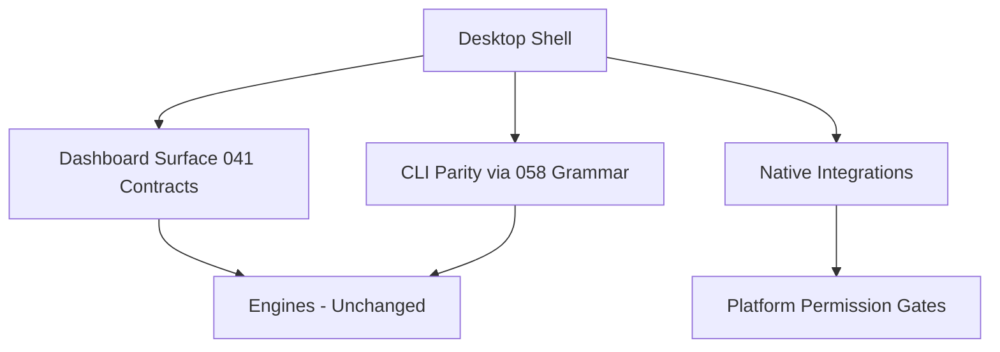

# 073 – Desktop Platform

**Document ID:** DEVOS-SPEC-073

**Version:** 0.1

**Status:** Draft

**Category:** Future

**Depends On:**

- DEVOS-SPEC-006 – Terminology
- DEVOS-SPEC-011 – Domain Model
- DEVOS-SPEC-020 – Workspace Specification
- DEVOS-SPEC-030 – System Architecture
- DEVOS-SPEC-040 – CLI
- DEVOS-SPEC-041 – Dashboard
- DEVOS-SPEC-048 – Update System
- DEVOS-SPEC-050 – SDK Overview

**Referenced By:**

- DEVOS-SPEC-076 – Cloud Platform
- DEVOS-SPEC-077 – Ecosystem
- DEVOS-SPEC-079 – Future Vision

---

# Abstract

This document defines the Desktop Platform, the forward-looking native application form factor for DevOS beyond the Dashboard's browser-style surface.

It defines desktop-specific integration duties, local resource boundaries, update participation, and parity obligations with existing interface specifications.

The desktop application is one more thin Layer 1 citizen: richer ergonomics, identical rules.

This specification is forward-looking and activates only through an approved RFC and ADR.

---

# Purpose

This specification answers the following question:

> **What does a native desktop presence add to DevOS without creating a second class of behavior?**

Deep platform integration such as native notifications, file association, and tray presence improves daily flow.

Everything else stays exactly as the CLI and Dashboard already govern it: same engines, same gates, same contracts.

---

# Goals

This specification aims to:

- Define the desktop shell as a Layer 1 interface per DEVOS-SPEC-030.
- Define native integration points and their permission discipline.
- Define packaging and update alignment with DEVOS-SPEC-048.
- Preserve full offline capability as a desktop advantage.
- Guarantee behavioral parity with first-party surfaces.

---

# Non Goals

This specification does not define:

- Visual design systems or interaction aesthetics, owned by DEVOS-SPEC-041 presentation concerns
- Platform-specific store distribution policies
- Embedded execution engines; engines remain shared platform services
- Mobile or web form factors, owned by DEVOS-SPEC-075 and DEVOS-SPEC-074

---

# Architecture Position

Rules:

- The shell embeds or composes existing interface contracts rather than redefining them.
- Native capabilities pass through explicit permission gates evaluated deny-by-default per DEVOS-SPEC-036.
- No business logic migrates into the shell, preserving the thin-layer rule.

---

# Native Integration Points

Desktop value concentrates in a small set of governed integrations.

| Integration         | Capability                                            | Discipline                                   |
| ------------------- | ------------------------------------------------------- | ------------------------------------------------ |
| Notifications       | Surface lifecycle and health events.                     | Subscribe through DEVOS-SPEC-057 grants only.     |
| File association    | Open manifests and bundles from the operating system.    | Import flows obey untrusted-input validation.      |
| Tray presence       | Quick status glance from health summaries.               | Consume DEVOS-SPEC-046 answers without recomputation. |
| Protocol handlers   | Deep links into workspace views.                         | Resolve through public identifiers only.           |
| Credential custody  | Integrate operating system keystores where available.    | Defer entirely to Security Engine guidance in DEVOS-SPEC-036. |

Every integration degrades gracefully when unavailable, keeping core flows intact everywhere else.

---

# Updates and Packaging

The desktop application participates in standard lifecycle machinery.

Rules:

- Application updates flow through declared channels with consent gates per DEVOS-SPEC-048.
- Bundled engine versions declare compatibility ranges per DEVOS-SPEC-059 and surface mismatches honestly.
- Packaging carries complete provenance so installations remain attributable.
- Uninstall removes all resident state within declared windows, honoring workspace ownership elsewhere.

---

# Offline Primacy

Desktop is the natural home of Offline First.

Rules:

- Every feature functions fully without connectivity except explicitly network-dependent enhancements.
- Absent connectivity reports honestly through health surfaces rather than failing silently.
- Local-first data residency remains the default posture; nothing uploads by default.

---

# Relationship to Version 0.1

Version 0.1 defines the Dashboard conceptually in DEVOS-SPEC-041 and the CLI fully in DEVOS-SPEC-040.

The desktop shell wraps these contracts natively.

Activation requires an RFC covering shell scope, an approved ADR preserving layering invariants, and conformance criteria before implementation ships.

Until activated, implementations MUST NOT ship partial desktop behavior under this document's name.

---

# Future Extension Invariants

The following invariants MUST hold when activated.

- The shell adds no business logic and no privileged API.
- Native integrations pass explicit permission gates.
- Parity with CLI and Dashboard behavior is exact on shared operations.
- Full offline capability holds across the entire surface.
- Updates respect consent and versioning policy unchanged.

These MUST NOT break the single Workspace aggregate model.

---

# Security Requirements

When activated, this extension enforces:

- Deny-by-default evaluation of every native capability request per DEVOS-SPEC-036.
- Keystore integration only under Security Engine custody direction, never parallel custody per DEVOS-SPEC-028.
- Attribution of installation, update, and integration grants through audit direction per DEVOS-SPEC-065.

---

# Future Extensions

Future specifications may add support for:

- System-wide search integration over granted workspace content
- Cross-surface handoff between desktop and mobile per DEVOS-SPEC-075
- Embedded terminal experiences bound to CLI grammar per DEVOS-SPEC-058

These extensions require their own RFCs and ADRs and MUST preserve the invariants above.

---

# References

- DEVOS-SPEC-000 – Specification Governance
- DEVOS-SPEC-006 – Terminology
- DEVOS-SPEC-007 – Scope
- DEVOS-SPEC-011 – Domain Model
- SPECIFICATION_RULES.md – Repository rule set (Rule 3)
- DEVOS-SPEC-020 – Workspace Specification
- DEVOS-SPEC-028 – Secret Specification
- DEVOS-SPEC-030 – System Architecture
- DEVOS-SPEC-036 – Security Engine
- DEVOS-SPEC-040 – CLI
- DEVOS-SPEC-041 – Dashboard
- DEVOS-SPEC-046 – Health System
- DEVOS-SPEC-048 – Update System
- DEVOS-SPEC-050 – SDK Overview
- DEVOS-SPEC-057 – Events API
- DEVOS-SPEC-058 – CLI API
- DEVOS-SPEC-059 – Versioning Policy
- DEVOS-SPEC-065 – Audit System
- DEVOS-SPEC-074 – Web Platform
- DEVOS-SPEC-075 – Mobile Platform
- DEVOS-SPEC-076 – Cloud Platform
- DEVOS-SPEC-079 – Future Vision

---

# Revision History

| Version | Date | Author             | Notes         |
| ------- | ---- | ------------------ | ------------- |
| 0.1     | TBD  | DevOS Contributors | Initial Draft |
