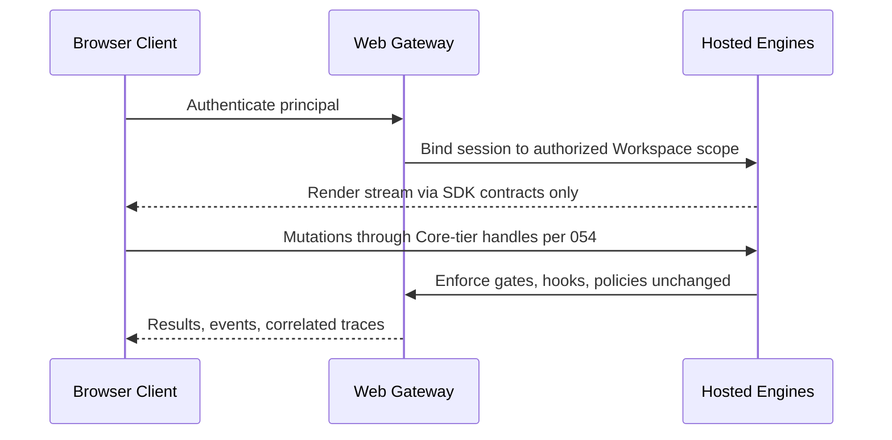

# 074 – Web Platform

**Document ID:** DEVOS-SPEC-074

**Version:** 0.1

**Status:** Draft

**Category:** Future

**Depends On:**

- DEVOS-SPEC-006 – Terminology
- DEVOS-SPEC-011 – Domain Model
- DEVOS-SPEC-020 – Workspace Specification
- DEVOS-SPEC-030 – System Architecture
- DEVOS-SPEC-041 – Dashboard
- DEVOS-SPEC-050 – SDK Overview
- DEVOS-SPEC-055 – API Specification
- DEVOS-SPEC-068 – Remote Agents

**Referenced By:**

- DEVOS-SPEC-073 – Desktop Platform
- DEVOS-SPEC-075 – Mobile Platform
- DEVOS-SPEC-076 – Cloud Platform
- DEVOS-SPEC-079 – Future Vision

---

# Abstract

This document defines the Web Platform, the forward-looking hosted browser access model for DevOS Workspaces.

It defines hosted session architecture, trust boundaries between browser clients and Workspace custody, secret-handling prohibitions unique to remote rendering, and parity obligations with first-party surfaces.

The web platform extends where workspaces live; it never relocates ownership.

This specification is forward-looking and activates only through an approved RFC and ADR.

---

# Purpose

This specification answers the following question:

> **How can a browser reach a real Workspace without turning the aggregate into someone else's database?**

Hosting executes engines somewhere; ownership stays with the Actor.

Browser clients render through standard SDK surfaces, secrets never cross into rendered output, and every session remains attributable end to end.

---

# Goals

This specification aims to:

- Define hosted sessions binding browser clients to Workspace custody locations.
- Define the client contract consuming only public SDK surfaces.
- Define strict secret-display prohibitions for remote rendering.
- Define session attribution and termination duties.
- Preserve behavioral parity with local surfaces.

---

# Non Goals

This specification does not define:

- Hosting infrastructure, tenancy isolation mechanics, or datacenter topology
- Cloud commercial offerings, owned by DEVOS-SPEC-076
- Offline browsing beyond explicitly cached views
- Mobile-specific interaction, owned by DEVOS-SPEC-075

---

# Session Architecture

A hosted session couples one authenticated principal to one workspace custody location.

Rules:

- Custody location is explicit metadata; users always know where their aggregates execute.
- Clients consume DEVOS-SPEC-054 and DEVOS-SPEC-055 contracts exclusively; no private gateway API exists.
- Every gate that guards local operation guards hosted operation identically.

---

# Secret Prohibitions

Remote rendering creates leak paths that local operation does not.

Prohibitions:

- Raw secret values MUST NEVER reach browser memory, storage, or network payloads in any encoding.
- Masked presentation follows the same default-masking discipline as CLI surfaces per DEVOS-SPEC-058.
- Reveal flows are unavailable through web clients unless a future ADR defines audited equivalents stronger than local flows.
- Clipboard, screenshot-assist, and export paths pass the Redaction Service of DEVOS-SPEC-036 without exception.

These prohibitions bind regardless of client capability negotiation.

---

# Parity Obligations

Web access is ordinary access.

Rules:

- Capabilities exposed match first-party surface parity per DEVOS-SPEC-050.
- Long operations report canonical states with honest cancellation per DEVOS-SPEC-055.
- Events stream under the same authorization grammar as any subscriber per DEVOS-SPEC-057.
- Interface-level differences are presentational only and documented as such.

---

# Session Governance

Hosted sessions carry operational duties beyond local use.

| Duty            | Requirement                                                              |
| --------------- | -------------------------------------------------------------------------- |
| Attribution     | Sessions carry principal identity plus correlation identifiers throughout.  |
| Termination     | Explicit logout, timeout, and revocation invalidate handles immediately.    |
| Concurrency     | Workspace mutation exclusivity holds across all simultaneous clients.       |
| Audit           | Session establishment and administration feed audit direction per DEVOS-SPEC-065. |
| Degradation     | Custody relocation or unavailability reports honestly, never silently.      |

---

# Relationship to Version 0.1

Version 0.1 is local-first by design; the Dashboard of DEVOS-SPEC-041 runs against local workspaces.

The Web Platform adds hosted reach.

Activation requires an RFC covering hosting boundaries, an approved ADR preserving aggregate invariants, and conformance criteria before implementation ships.

Until activated, implementations MUST NOT ship partial hosted behavior under this document's name.

---

# Future Extension Invariants

The following invariants MUST hold when activated.

- Ownership and custody remain distinct; hosting never acquires ownership.
- Browser clients hold no authority beyond SDK-surface grants.
- Raw secret values never exist client-side in any form.
- All hosted operations traverse identical gates as local ones.
- Session lifecycle ends cleanly on every exit path.

These MUST NOT break the single Workspace aggregate model.

---

# Security Requirements

When activated, this extension enforces:

- Deny-by-default authorization for every gateway-mediated request per DEVOS-SPEC-036.
- Transport integrity and mutual authentication before any Workspace binding.
- Full session attribution through events feeding DEVOS-SPEC-065.
- Redaction at every observable boundary per DEVOS-SPEC-036, including diagnostics and error paths.

---

# Future Extensions

Future specifications may add support for:

- Collaborative multi-client sessions under mutation exclusivity extensions
- Edge-hosted custody regions selected by policy per DEVOS-SPEC-063
- Progressive offline caches with explicit consistency labels

These extensions require their own RFCs and ADRs and MUST preserve the invariants above.

---

# References

- DEVOS-SPEC-000 – Specification Governance
- DEVOS-SPEC-006 – Terminology
- DEVOS-SPEC-007 – Scope
- DEVOS-SPEC-011 – Domain Model
- SPECIFICATION_RULES.md – Repository rule set (Rule 2)
- DEVOS-SPEC-020 – Workspace Specification
- DEVOS-SPEC-028 – Secret Specification
- DEVOS-SPEC-030 – System Architecture
- DEVOS-SPEC-036 – Security Engine
- DEVOS-SPEC-037 – Event System
- DEVOS-SPEC-041 – Dashboard
- DEVOS-SPEC-050 – SDK Overview
- DEVOS-SPEC-054 – Workspace SDK
- DEVOS-SPEC-055 – API Specification
- DEVOS-SPEC-057 – Events API
- DEVOS-SPEC-058 – CLI API
- DEVOS-SPEC-065 – Audit System
- DEVOS-SPEC-068 – Remote Agents
- DEVOS-SPEC-073 – Desktop Platform
- DEVOS-SPEC-075 – Mobile Platform
- DEVOS-SPEC-076 – Cloud Platform
- DEVOS-SPEC-079 – Future Vision

---

# Revision History

| Version | Date | Author             | Notes         |
| ------- | ---- | ------------------ | ------------- |
| 0.1     | TBD  | DevOS Contributors | Initial Draft |
