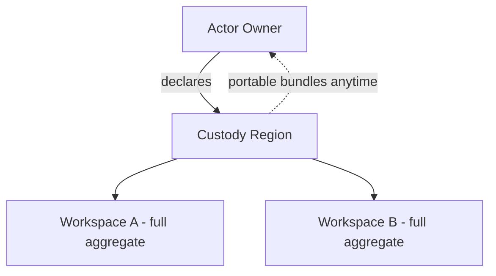

# 076 – Cloud Platform

**Document ID:** DEVOS-SPEC-076

**Version:** 0.1

**Status:** Draft

**Category:** Future

**Depends On:**

- DEVOS-SPEC-006 – Terminology
- DEVOS-SPEC-011 – Domain Model
- DEVOS-SPEC-020 – Workspace Specification
- DEVOS-SPEC-028 – Secret Specification
- DEVOS-SPEC-030 – System Architecture
- DEVOS-SPEC-036 – Security Engine
- DEVOS-SPEC-048 – Update System
- DEVOS-SPEC-050 – SDK Overview
- DEVOS-SPEC-064 – Cloud Sync
- DEVOS-SPEC-065 – Audit System
- DEVOS-SPEC-067 – License Management
- DEVOS-SPEC-074 – Web Platform

**Referenced By:**

- DEVOS-SPEC-073 – Desktop Platform
- DEVOS-SPEC-074 – Web Platform
- DEVOS-SPEC-075 – Mobile Platform
- DEVOS-SPEC-079 – Future Vision

---

# Abstract

This document defines the Cloud Platform, the forward-looking hosted execution model where DevOS engines run as a managed service on behalf of their owners.

It defines custody regions, tenancy isolation requirements, portability guarantees preventing lock-in, and the operational duties of running engines remotely.

The cloud platform hosts workspaces; it never captures them.

This specification is forward-looking and activates only through an approved RFC and ADR.

---

# Purpose

This specification answers the following question:

> **What must a managed hosting offering guarantee so that convenience never becomes captivity?**

Hosted engines run the same specifications with the same gates.

Aggregates remain exportable in full at any moment, secrets stay under owner-key discipline, and exit is a first-class flow rather than an escape hatch.

---

# Goals

This specification aims to:

- Define custody regions binding hosted aggregates to declared locations.
- Define tenancy isolation as a structural requirement.
- Define unconditional portability through standard bundle flows.
- Define operational transparency duties for hosted execution.
- Preserve local parity: hosted and local Workspaces behave identically.

---

# Non Goals

This specification does not define:

- Commercial terms, pricing, or service-level agreements
- Specific infrastructure providers or datacenter geographies beyond region abstraction
- Browser client behavior, owned by DEVOS-SPEC-074
- Synchronization protocol internals, owned by DEVOS-SPEC-064
- Serverless or edge execution models

---

# Custody Regions

Every hosted Workspace executes inside exactly one declared custody region.

Rules:

- Region metadata is visible to owners at all times.
- Cross-region moves occur only through explicit owner-initiated flows using standard export and import semantics.
- Regional residency constraints, where applicable, bind storage and processing alike.

---

# Tenancy Isolation

Isolation between tenants is structural, not advisory.

| Requirement       | Standard                                                            |
| ----------------- | --------------------------------------------------------------------- |
| Aggregate boundary | No operation may observe another tenant's identifiers or content.      |
| Resource fairness  | Noisy neighbors degrade their own latency first, visibly.              |
| Failure containment | Tenant-side faults never surface inside other tenants' traces.        |
| Maintenance notice | Platform maintenance respects Busy exclusivity per DEVOS-SPEC-044.     |

Verification of these standards belongs in conformance criteria published before any hosted launch.

---

# Portability Guarantee

Exit equals import elsewhere, permanently.

Rules:

- Full-aggregate bundles export on demand without negotiation, honoring references-not-secrets per DEVOS-SPEC-028.
- Export completeness matches local implementations byte-semantically per DEVOS-SPEC-029 round-trip guarantees.
- Deletion cascades completely within declared windows, including secret resolution cutoff per DEVOS-SPEC-028.
- No hosted-only capability may create artifacts unreadable by conformant local implementations.

Lock-in by format is prohibited; lock-in by excellence is the only permitted strategy.

---

# Operational Transparency

Hosting adds duties that local operation never needs.

Rules:

- Hosted engine versions follow declared channels with consent gates for disruptive upgrades per DEVOS-SPEC-048.
- Availability, maintenance windows, and incident notices surface through health surfaces per DEVOS-SPEC-046.
- Administrative access to tenant aggregates requires audited justification flowing into DEVOS-SPEC-065.
- Licensing for hosted commercial extensions integrates through DEVOS-SPEC-067 rather than private schemes.

---

# Local Parity

Hosted execution changes location, not behavior.

Rules:

- The same numbered specifications govern both modes; no cloud-specific forks exist.
- SDK contracts behave identically across modes per DEVOS-SPEC-050.
- Workspaces move between local and hosted custody through ordinary export and import.
- Offline-first values persist locally regardless of hosted adoption.

---

# Relationship to Version 0.1

Version 0.1 runs entirely on user machines.

The Cloud Platform adds managed custody as an option.

Activation requires an RFC covering regional and tenancy models, an approved ADR preserving aggregate invariants, and conformance criteria before any hosted launch.

Until activated, implementations MUST NOT ship partial hosted custody under this document's name.

---

# Future Extension Invariants

The following invariants MUST hold when activated.

- Owners always know where their aggregates execute.
- Exit through standard bundles remains unconditional and complete.
- Tenancy isolation failures are defects above all functional defects.
- Hosted and local behavior parity holds across shared specifications.
- All administrative access is audited and attributable.

These MUST NOT break the single Workspace aggregate model.

---

# Security Requirements

When activated, this extension enforces:

- Owner-key discipline over hosted secret custody consistent with DEVOS-SPEC-028, with plaintext never resident outside transient resolution.
- Deny-by-default authorization across every multi-tenant boundary per DEVOS-SPEC-036.
- Complete audit trails for platform administration feeding DEVOS-SPEC-065.

---

# Future Extensions

Future specifications may add support for:

- Sovereignty zones with contractual residency enforcement
- Edge-region read replicas under sync consistency rules
- Sustainability reporting tied to custody region selection

These extensions require their own RFCs and ADRs and MUST preserve the invariants above.

---

# References

- DEVOS-SPEC-000 – Specification Governance
- DEVOS-SPEC-006 – Terminology
- DEVOS-SPEC-007 – Scope
- DEVOS-SPEC-011 – Domain Model
- SPECIFICATION_RULES.md – Repository rule set (Rule 3)
- DEVOS-SPEC-020 – Workspace Specification
- DEVOS-SPEC-028 – Secret Specification
- DEVOS-SPEC-029 – Workspace Manifest
- DEVOS-SPEC-030 – System Architecture
- DEVOS-SPEC-036 – Security Engine
- DEVOS-SPEC-044 – Workspace Lifecycle
- DEVOS-SPEC-046 – Health System
- DEVOS-SPEC-048 – Update System
- DEVOS-SPEC-050 – SDK Overview
- DEVOS-SPEC-059 – Versioning Policy
- DEVOS-SPEC-064 – Cloud Sync
- DEVOS-SPEC-065 – Audit System
- DEVOS-SPEC-067 – License Management
- DEVOS-SPEC-073 – Desktop Platform
- DEVOS-SPEC-074 – Web Platform
- DEVOS-SPEC-075 – Mobile Platform
- DEVOS-SPEC-079 – Future Vision

---

# Revision History

| Version | Date | Author             | Notes         |
| ------- | ---- | ------------------ | ------------- |
| 0.1     | TBD  | DevOS Contributors | Initial Draft |
