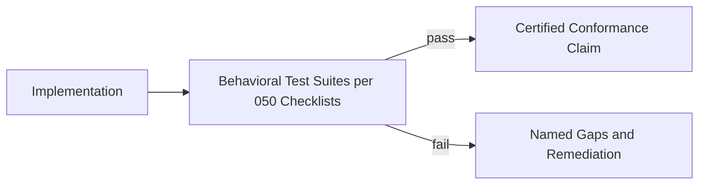

# 077 – Ecosystem

**Document ID:** DEVOS-SPEC-077

**Version:** 0.1

**Status:** Draft

**Category:** Future

**Depends On:**

- DEVOS-SPEC-000 – Specification Governance
- DEVOS-SPEC-006 – Terminology
- DEVOS-SPEC-007 – Scope
- DEVOS-SPEC-050 – SDK Overview
- DEVOS-SPEC-059 – Versioning Policy
- DEVOS-SPEC-067 – License Management
- DEVOS-SPEC-070 – Marketplace

**Referenced By:**

- DEVOS-SPEC-078 – V2 Roadmap
- DEVOS-SPEC-079 – Future Vision

---

# Abstract

This document defines the Ecosystem, the forward-looking community and compatibility framework through which DevOS grows beyond its original contributors.

It defines conformance certification, community governance participation, interoperability commitments, and the stewardship duties that keep an open specification open.

The ecosystem is how a specification becomes a standard.

This specification is forward-looking and activates only through an approved RFC and ADR.

---

# Purpose

This specification answers the question:

> **How does DevOS scale from a project to a platform many independent parties build on, without fragmenting or closing?**

Through testable conformance, open governance, and binding interoperability promises.

Anyone can implement; everyone can verify; nobody needs permission to participate.

---

# Goals

This specification aims to:

- Define conformance certification built on existing checklists.
- Define community participation paths within established governance.
- Define interoperability commitments across implementations.
- Define stewardship duties protecting openness over time.

---

# Non Goals

This specification does not define:

- Foundation or legal entity formation
- Trademark enforcement mechanics
- Conference or event programs
- Marketplace economics, owned by DEVOS-SPEC-070

---

# Conformance Certification

Certification turns claims into evidence.

Rules:

- Claims cite exact surfaces covered, honoring partial-conformance honesty from DEVOS-SPEC-050.
- Behavioral tests derive from published checklists rather than implementation details.
- Certifications bind to version ranges per DEVOS-SPEC-059 and lapse when ranges do.
- Commercial extensions integrate licensing through DEVOS-SPEC-067 rather than private certification gates.

---

# Community Participation

Governance already defines roles; the ecosystem widens its doors.

| Path              | Entry Point                                                  |
| ----------------- | -------------------------------------------------------------- |
| Specification work | RFCs, reviews, and editorial contributions per CONTRIBUTING.md. |
| Implementation     | Conformance checklists and behavioral suites.                   |
| Extension authoring | SDK tiers per DEVOS-SPEC-051 through DEVOS-SPEC-053.           |
| Distribution       | Marketplace listings once activated per DEVOS-SPEC-070.         |

Rules:

- Decision authority remains with GOVERNANCE.md structures; ecosystems add voices, never vetoes.
- All community infrastructure operates openly by default.
- Code of conduct applies everywhere the community gathers.

---

# Interoperability Commitments

Cross-implementation behavior is the ecosystem's core promise.

Commitments:

1. Workspaces exported from any conformant implementation import into every other, verified through round-trip equivalence per DEVOS-SPEC-029.
2. Reason codes, topics, hook points, and exit classes mean the same thing everywhere their specifications define them.
3. Compatibility ranges evaluate identically across implementations per DEVOS-SPEC-059.
4. Behavioral differences beyond documented presentation concerns are defects, not features.

These commitments make multi-vendor ecosystems coherent instead of merely possible.

---

# Stewardship Duties

Openness requires active defense.

Duties:

- Specification evolution remains public, reviewable, and governed per DEVOS-SPEC-000 forever.
- No contributor, vendor, or foundation gains private authority over canonical documents.
- Deprecated capabilities retire only through declared windows, protecting downstream ecosystems per Rule 18 of SPECIFICATION_RULES.md.
- Stewards publish adoption health honestly, including failures.

Stewardship is measured by how safely others may build, not by how much gets built centrally.

---

# Relationship to Version 0.1

Version 0.1 establishes governance, contribution rules, and conformance-oriented drafting habits.

The Ecosystem adds certification and multi-party coordination atop that foundation.

Activation requires an RFC covering certification operations, an approved ADR preserving aggregate invariants, and publication of initial behavioral suites.

Until activated, conformance claims follow the checklist discipline of DEVOS-SPEC-050 directly.

---

# Future Extension Invariants

The following invariants MUST hold when activated.

- Certification measures behavior against published specifications, never politics.
- Governance authority stays inside established documents.
- Interoperability commitments bind all certified parties equally.
- Openness defaults are structural, not discretionary.
- Ecosystem growth never weakens aggregate invariants or security posture.

These MUST NOT break the single Workspace aggregate model.

---

# Security Requirements

When activated, this extension enforces:

- Certification evidence containing no secret material or tenant data per DEVOS-SPEC-028.
- Honest reporting obligations for discovered vulnerabilities across certified implementations.
- Attribution of certification decisions through audit direction per DEVOS-SPEC-065 where organizational tooling participates.

---

# Future Extensions

Future specifications may add support for:

- Mutual recognition agreements between independent certifiers
- Ecosystem-wide transparency logs for certifications and revocations
- Regional community chapters under shared governance

These extensions require their own RFCs and ADRs and MUST preserve the invariants above.

---

# References

- DEVOS-SPEC-000 – Specification Governance
- DEVOS-SPEC-006 – Terminology
- DEVOS-SPEC-007 – Scope
- SPECIFICATION_RULES.md – Repository rule set (Rule 18)
- DEVOS-SPEC-029 – Workspace Manifest
- DEVOS-SPEC-050 – SDK Overview
- DEVOS-SPEC-051 – Plugin SDK
- DEVOS-SPEC-052 – Provider SDK
- DEVOS-SPEC-053 – Template SDK
- DEVOS-SPEC-055 – API Specification
- DEVOS-SPEC-059 – Versioning Policy
- DEVOS-SPEC-065 – Audit System
- DEVOS-SPEC-067 – License Management
- DEVOS-SPEC-070 – Marketplace
- DEVOS-SPEC-078 – V2 Roadmap
- DEVOS-SPEC-079 – Future Vision
- CONTRIBUTING.md – Contribution process
- GOVERNANCE.md – Roles and decision making

---

# Revision History

| Version | Date | Author             | Notes         |
| ------- | ---- | ------------------ | ------------- |
| 0.1     | TBD  | DevOS Contributors | Initial Draft |
