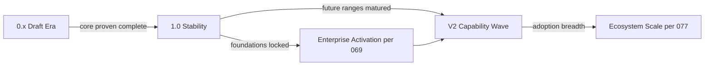

# 078 – V2 Roadmap

**Document ID:** DEVOS-SPEC-078

**Version:** 0.1

**Status:** Draft

**Category:** Future

**Depends On:**

- DEVOS-SPEC-000 – Specification Governance
- DEVOS-SPEC-006 – Terminology
- DEVOS-SPEC-007 – Scope
- DEVOS-SPEC-011 – Domain Model
- DEVOS-SPEC-059 – Versioning Policy
- DEVOS-SPEC-069 – Enterprise Roadmap

**Referenced By:**

- DEVOS-SPEC-077 – Ecosystem
- DEVOS-SPEC-079 – Future Vision

---

# Abstract

This document defines the V2 Roadmap: the planning frame for the first major stabilization milestone beyond Version 0.1.

It defines what Version 2 means under the versioning policy, the candidate themes drawn from forward-looking ranges, the stability obligations a 1.0 transition carries first, and the governance path every theme follows.

V2 is direction with discipline, never a promise of dates.

This specification is forward-looking and evolves through normal governance.

---

# Purpose

This specification answers the following question:

> **What comes after the draft era, and in what order does maturity arrive?**

Stability first: Version 1.0 locks the core.

Capability second: Enterprise and Future ranges activate atop stable foundations.

Scale third: ecosystem mechanisms multiply what exists.

Each stage gates on readiness, not ambition.

---

# Goals

This specification aims to:

- Define the milestone ladder from 0.x drafts to 1.0 to V2 themes.
- Define candidate themes with their dependency sources.
- Define the 1.0 stability contract as the universal precondition.
- Keep roadmap evolution itself governed and reviewable.

---

# Non Goals

This specification does not define:

- Release dates or scheduling commitments
- Feature-level design, which belongs to numbered specifications
- Enterprise sequencing details, owned by DEVOS-SPEC-069
- Research agendas, owned by DEVOS-SPEC-072

---

# Milestone Ladder

Rules:

- No milestone skips its predecessors; the graph is a gate structure.
- 1.0 requires every core specification stable, conformance criteria published, and breaking-change discipline fully strict per DEVOS-SPEC-059.
- V2 capability waves ride on activated foundations, never parallel ones.

---

# Candidate Themes

Themes are drawn from existing forward-looking documents; none invent new scope.

| Theme                       | Source Range            | Precondition                              |
| --------------------------- | ------------------------- | --------------------------------------------- |
| Governed collaboration      | 060 through 063           | 1.0 stability plus Phase 1 of DEVOS-SPEC-069. |
| Consistency at distance     | 064, 066                  | Audit foundation active.                      |
| Commercial participation    | 067, 070                  | Marketplace attestation model approved.       |
| Trusted autonomy            | 068, 071                  | Full enterprise invariant floor operational.  |
| Everywhere surfaces         | 073 through 075           | Hosted custody model proven per 074/076.      |
| Standardhood                | 077                       | Multiple independent conformant implementations. |

Theme selection per release follows community prioritization within GOVERNANCE.md structures.

---

# The 1.0 Stability Contract

Everything downstream depends on this contract holding.

Obligations:

1. Core specifications carry full SemVer strictness: breaking changes only via major bumps with migrations.
2. Every canonical schema freezes its v0 namespace compatibility story per Rule 17 of SPECIFICATION_RULES.md.
3. Conformance checklists across SDK tiers become testable suites per DEVOS-SPEC-050.
4. The single Workspace aggregate model stands verified across implementations.
5. Security posture invariants receive independent review before the 1.0 declaration.

Declaring 1.0 without these is prohibited regardless of external pressure.

---

# Roadmap Evolution

This document plans; it does not bind.

Rules:

- Theme additions and removals follow RFC and ADR paths like everything else.
- Dependencies between themes update whenever their source specifications evolve.
- Superseded themes retire into history rather than lingering as debt.
- The roadmap never overrides numbered specifications; it sequences them.

---

# Relationship to Version 0.1

Version 0.1 deliberately excludes activation of every range feeding these themes per DEVOS-SPEC-007.

The V2 Roadmap gives those exclusions a destination so they read as sequencing, not rejection.

Nothing here obligates implementations before their prerequisites activate through proper governance.

---

# Future Extension Invariants

The following invariants MUST always hold.

- Milestones gate on readiness evidence, never calendars.
- Themes originate exclusively from governed forward-looking documents.
- The 1.0 contract precedes every capability wave unconditionally.
- Roadmap changes remain public, reviewed, and attributable.
- Aggregate invariants survive every planned future by construction.

These MUST NOT break the single Workspace aggregate model.

---

# Security Requirements

This roadmap enforces:

- That no milestone sequence can ship autonomy ahead of auditability or commerce ahead of consent structures.
- That security reviews gate the 1.0 declaration absolutely, per DEVOS-SPEC-036 posture.

---

# Future Extensions

Future revisions may add support for:

- Post-V2 horizon framing once V2 themes mature
- Cross-range integration milestones spanning enterprise and future activations
- Community-driven prioritization mechanics aligned with DEVOS-SPEC-077

These extensions require their own RFCs and ADRs and MUST preserve the invariants above.

---

# References

- DEVOS-SPEC-000 – Specification Governance
- DEVOS-SPEC-006 – Terminology
- DEVOS-SPEC-007 – Scope
- SPECIFICATION_RULES.md – Repository rule set (Rule 18)
- DEVOS-SPEC-011 – Domain Model
- DEVOS-SPEC-036 – Security Engine
- DEVOS-SPEC-050 – SDK Overview
- DEVOS-SPEC-059 – Versioning Policy
- DEVOS-SPEC-060 – Organizations
- DEVOS-SPEC-063 – Policy Engine
- DEVOS-SPEC-064 – Cloud Sync
- DEVOS-SPEC-065 – Audit System
- DEVOS-SPEC-066 – Workspace Sharing
- DEVOS-SPEC-067 – License Management
- DEVOS-SPEC-068 – Remote Agents
- DEVOS-SPEC-069 – Enterprise Roadmap
- DEVOS-SPEC-070 – Marketplace
- DEVOS-SPEC-071 – AI Agents
- DEVOS-SPEC-072 – Research Platform
- DEVOS-SPEC-073 – Desktop Platform
- DEVOS-SPEC-074 – Web Platform
- DEVOS-SPEC-075 – Mobile Platform
- DEVOS-SPEC-076 – Cloud Platform
- DEVOS-SPEC-077 – Ecosystem
- DEVOS-SPEC-079 – Future Vision

---

# Revision History

| Version | Date | Author             | Notes         |
| ------- | ---- | ------------------ | ------------- |
| 0.1     | TBD  | DevOS Contributors | Initial Draft |
